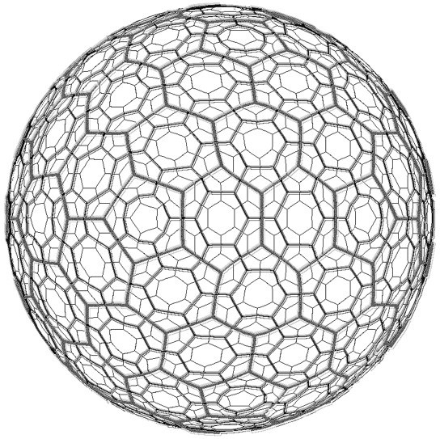
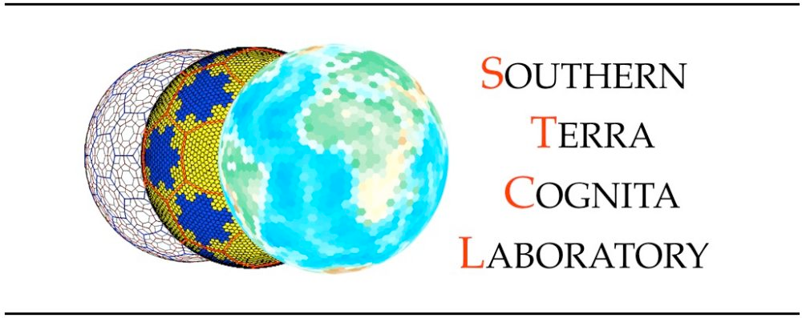
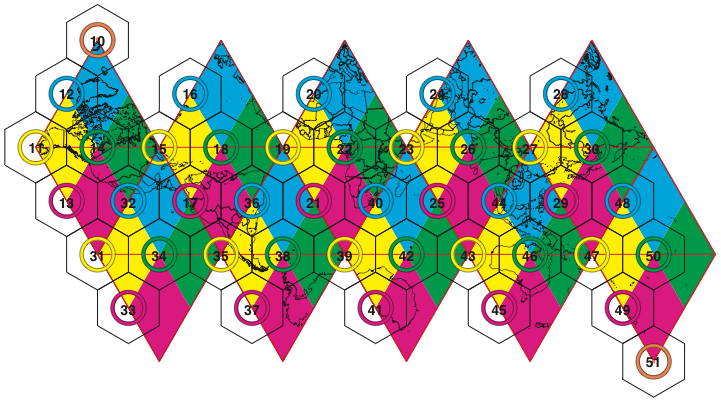
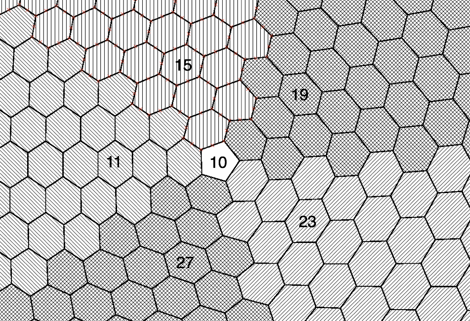
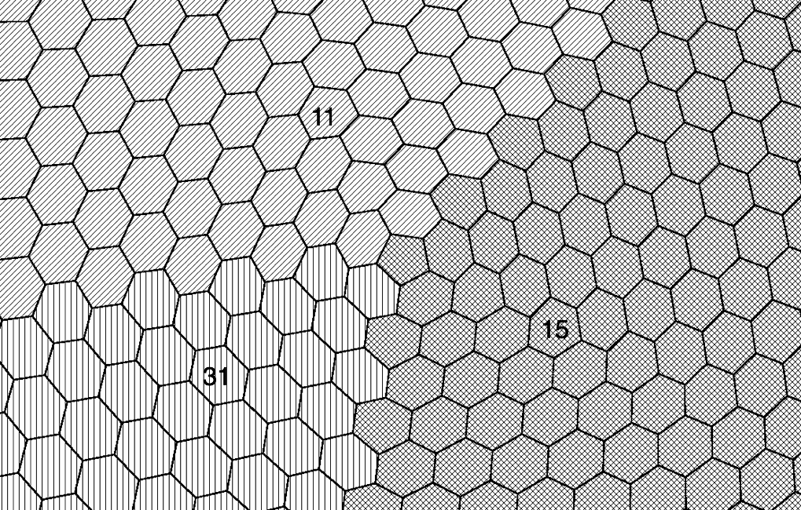
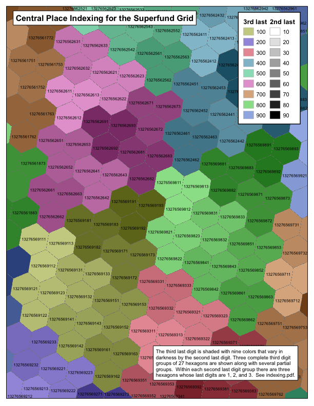
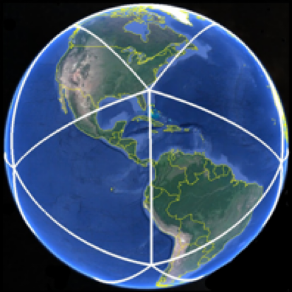
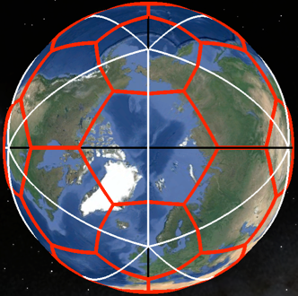
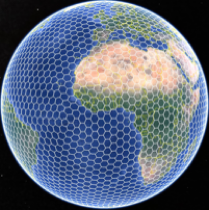

# User Documentation for DGGRID version 8.41



**Discrete Global Grid Generation Software**

**Kevin Sahr**



## Terms of Use

This documentation is part of **DGGRID**.

**DGGRID** is free software: you can redistribute it and/or modify it under the terms of the GNU Affero General Public License as published by the Free Software Foundation, either version 3 of the License, or (at your option) any later version.

**DGGRID** is distributed in the hope that it will be useful, but WITHOUT ANY WARRANTY; without even the implied warranty of MERCHANTABILITY or FITNESS FOR A PARTICULAR PURPOSE. See the GNU Affero General Public License for more details.

You should have received a copy of the GNU Affero General Public License along with the **DGGRID** source code. If not, see [https://www.gnu.org/licenses/](https://www.gnu.org/licenses/).

## Credits

**DGGRID** was primarily written in C++ by Kevin Sahr. See the file **CHANGELOG.md** that comes with the source code for additional contributors.

The original **DGGRID** specifications were developed by (in alphabetical order): A. Ross Kiester, Tony Olsen, Barbara Rosenbaum, Kevin Sahr, Ann Whelan, and Denis White.

**DGGRID** was made possible in part by funding from the **US Environmental Protection Agency**, **PlanetRisk, Inc.**, **Culmen International,** the **[Ruhr-University Bochum/GeoInsight Project](https://geoinsight.ai)**, **Turtle Conservancy**, and the **[University of Tartu Landscape Geoinformatics Lab](https://landscape-geoinformatics.ut.ee/)**.

**DGGRID** can optionally make use of the following external library (not included):

- The Open Source Geospatial Foundation's GDAL translator library for raster and vector geospatial data formats (see [gdal.org](http://gdal.org))

**DGGRID** uses the following third-party libraries (included with the **DGGRID** source code):

-  Angus Johnson's Clipper library; see [http://www.angusj.com](http://www.angusj.com).
- George Marsaglia's multiply-with-carry "Mother-of-all-RNGs" pseudo-random number generation function.
- The gnomonic projection code is adapted from Gerald Evenden's PROJ.4 library
- Frank Warmerdam's Shapelib library

The github source code distribution contains instructions on building **DGGRID**. The examples directory contains example **DGGRID** metafiles (with associated input files).

**DGGRID** version 8.41 was released May 31, 2025

**[www.discreteglobalgrids.org](www.discreteglobalgrids.org)**

**[https://github.com/sahrk/DGGRID](https://github.com/sahrk/DGGRID)**

## Table of Contents

1. [Introduction](#introduction)
2. [Metafile Format](#metafile-format)
3. [General Parameters](#general-parameters)
4. [Specifying the DGG](#specifying-the-dgg)
   - [Background](#background)
   - [Preset DGG Types](#preset-dgg-types)
   - [Manually Setting DGG Parameters](#manually-setting-dgg-parameters)
5. [Specifying Per-Cell Grid Output](#specifying-per-cell-grid-output)
6. [Grid Generation: Whole Earth or Clipping Polygons](#grid-generation-whole-earth-or-clipping-polygons)
7. [Specifying Point File Input](#specifying-point-file-input)
8. [Grid Generation: Point Binning](#grid-generation-point-binning)
9. [Binning Point Values](#binning-point-values)
10. [Presence/Absence Binning](#presenceabsence-binning)
11. [Performing Address Conversions](#performing-address-conversions)
12. [Outputting Grid Statistics](#outputting-grid-statistics)

- [Appendix A. DGGRID Metafile Parameters](#appendix-a-dggrid-metafile-parameters)
- [Appendix B. Default Values for Preset DGG Types](#appendix-b-default-values-for-preset-dgg-types)
- [Appendix C. DGG Address Forms](#appendix-c-dgg-address-forms)
- [Appendix D. Statistics for Some Preset ISEA DGGs](#appendix-d-statistics-for-some-preset-isea-dggs)
  - [Aperture 3: ISEA3H](#aperture-3-isea3h)
  - [Aperture 4: ISEA4H](#aperture-4-isea4h)
  - [PlanetRisk Grid](#planetrisk-grid)
  - [Mixed Aperture 4 and 3: ISEA43H](#mixed-aperture-4-and-3-isea43h)
  - [Notes](#notes)
- [Appendix E. The EPA Superfund_500m DGGS](#appendix-e-the-epa-superfund_500m-dggs)
- [Appendix F. The PlanetRisk DGGS](#appendix-f-the-planetrisk-dggs)
- [Appendix G. References](#appendix-g-references)


## 1. Introduction

**DGGRID** is a command-line application designed to generate and manipulate icosahedral discrete global grids (DGGs) \[Sahr et al., 2003\]. A single execution of **DGGRID** can perform one of six distinct operations:

1. **Grid Generation from clipping polygons**. Generate the cells of a DGG, either covering the complete surface of the earth or covering only a specific set of regions on the earth's surface.
2.  **Grid Generation from points**. Generate the cells of a DGG, either covering the complete surface of the earth or covering only a specific set of regions on the earth's surface.
3. **Point Value Binning**. Bin a set of floating-point values associated with point locations into the cells of a DGG, by assigning to each DGG cell the arithmetic mean of the values which are contained in that cell.
4. **Presence/Absence Binning**. Given a set of input files, each containing point locations associated with a particular class, **DGGRID** outputs, for each cell of a DGG, a vector indicating whether or not each class is present in that cell.
5. **Address Conversion**. Transform a file of locations from one address form (such as longitude/latitude) to another (such as DGG cell indexes).
6. **Output Grid Statistics**. Output a table of grid characteristics for the specified DGG.

**DGGRID** is designed to be run from the Unix command line. **DGGRID** requires a single command line argument, the name of a "metafile," which is a plain text file that describes the actions that **DGGRID** is to perform in that run. Thus **DGGRID** is executed by typing at the command line:

dggrid *metaFileName.meta*

The metafile consists of a series of key-value pairs that tell **DGGRID** how to proceed. The format of this metafile is described in the next section. The rest of the sections in this documentation give more detail on setting up metafile parameters to control the execution of **DGGRID**.

## 2. Metafile Format

Metafiles are text files in which each line is either a comment, a blank line, or a key-value pair that designates the value of a parameter for **DGGRID**. Blank lines are ignored by **DGGRID**. Lines beginning with '\#' are comments and are also ignored by **DGGRID**.

A parameter is specified by a single line of the form:

*parameterName value*

Parameter names are not case sensitive. A parameter can be of one of five types. The five parameter types, with a description of their legal values, are:

1. **boolean**. Legal values are **TRUE** and **FALSE** (case sensitive).
2. **integer**. Any integer is a legal value.
3. **double**. Any real number, specified in decimal form, is a legal value.
4. **string**. The remainder of the line following the parameter name is interpreted as the value.
5. **choice**. Legal values consist of one of a finite set of keywords specific to that parameter. The values of choice parameters are not case sensitive but by convention are usually written in all capital letters.

Some parameters are only used for specific operations or when specific other parameter conditions prevail. All parameters have a default value which is used if no value is specified. Detailed information on each parameter is given in the following sections and in **Appendix A**. Repeating a parameter specification within the same metafile over-writes the previously specified value; the last value given for a particular parameter will be used.

Note that a number of parameters from previous versions of **DGGRID** are still active in the code but are not described in this documentation; that is because those parameters have not been fully integrated with the new features in this beta release. Those parameters will be fully restored in a future release.

See the examples directory in the **DGGRID** source code distribution for examples of **DGGRID** metafiles.

## 3. General Parameters

In this section we describe the parameters which are used by every run of **DGGRID**.

As described in **Section 1**, each run of **DGGRID** consists of one of five distinct modes of operation. The operation is specified using the **choice** parameter dggrid_operation. The allowable values for this parameter are:

- `GENERATE_GRID` - perform grid generation from polygons (see **Sections 6**)
- `GENERATE_GRID_FROM_POINTS` - perform grid generation from points (see **Section** **8**)
- `BIN_POINT_VALS` - perform point value binning (see **Section 9**)
- `BIN_POINT_PRESENCE` - perform presence/absence binning (see **Section 10**)
- `TRANSFORM_POINTS` - perform address conversion (see **Section 11**)
- `OUTPUT_STATS` - output a table of grid characteristics (see **Section 12**)

All operation modes require the specification of a single DGG. The parameters for specifying a DGG are described in **Section 4**.

The **integer** parameter precision specifies the number of digits to the right of the decimal place **DGGRID** is to use when outputting floating point numbers, including latitude/longitude values.

The parameters verbosity, pause_on_startup, and pause_before_exit exist solely to support debugging and can be ignored by users. These parameters are described below.

The **integer** parameter verbosity is used to control the amount of debugging information which is printed by **DGGRID**. Valid values are from 0 to 3. The default value, 0, gives minimal output, which includes the value of all active parameter settings. It is not recommended that you increase this value.

Setting either of the **boolean** parameters pause_on_startup and/or pause_before_exit to TRUE causes **DGGRID** to pause execution either immediately after loading parameters, or just before program termination, respectively. The default value for both parameters is FALSE.

## 4. Specifying the DGG

### Background

As described in \[Sahr et al., 2003\], a DGG system can be specified by a set of independent design choices. The first design choice is the desired base polyhedron; **DGGRID** can generate DGGs that have an icosahedron as their base polyhedron. The remaining primary design choices are:

1. The orientation of the base polyhedron relative to the earth.
2. The hierarchical spatial partitioning method defined symmetrically on a face (or set of faces) of the base polyhedron. This usually includes specifying the cell topology and an *aperture*, which determines the area ratio between cells at sequential resolutions.
3. The transformation between each face and the corresponding spherical surface.
4. The resolution (or degree of recursive partitioning).

The current version of **DGGRID** supports DGGs that use either the Icosahedral Snyder Equal Area (ISEA) projection \[Snyder, 1992\] or the icosahedral projection of R. Buckminster Fuller \[1975\] (as developed analytically by Robert Gray \[1995\] and John Crider \[2008\]). **DGGRID** can generate grids with cells that are triangles, diamonds, or hexagons. Grids with a triangle or diamond topology must use an aperture of 4, while hexagon grids can use an aperture of 3, 4, 7, or an arbitrary mixed sequence of those apertures. **DGGRID** also supports specifically designed "preset" DGGs, including the mixed aperture hexagonal grids the US EPA **Superfund_500m** DGG (see **Appendix E**), and the PlanetRisk DGG (see **Appendix F**).

Detailed information about the parameters that specify each of the DGG design choices are given below, along with a discussion on specifying the spherical earth radius.

### Preset DGG Types

**DGGRID** provides a number of preset DGG types for your use. A preset type can be chosen by specifying one of the following values for the **choice** parameter dggs_type:

- `CUSTOM` (default) - indicates that the grid parameters will be specified manually (see below)
- `SUPERFUND` - the **Superfund_500m** grid (see **Appendix E**)
- `PLANETRISK` - the **PlanetRisk** grid (see **Appendix F**)
- `ISEA4T` - ISEA projection with triangle cells and an aperture of 4
- `ISEA4D` - ISEA projection with diamond cells and an aperture of 4
- `ISEA3H` - ISEA projection with hexagon cells and an aperture of 3
- `ISEA4H` - ISEA projection with hexagon cells and an aperture of 4
- `ISEA7H` - ISEA projection with hexagon cells and an aperture of 7
- `ISEA43H` - ISEA projection with hexagon cells and a mixed sequence of aperture 4 resolutions followed by aperture 3 resolutions
- `FULLER4T` - FULLER projection with triangle cells and an aperture of 4
- `FULLER4D` - FULLER projection with diamond cells and an aperture of 4
- `FULLER3H` - FULLER projection with hexagon cells and an aperture of 3
- `FULLER4H` - FULLER projection with hexagon cells and an aperture of 4
- `FULLER7H` - FULLER projection with hexagon cells and an aperture of 7
- `FULLER43H` - FULLER projection with hexagon cells and a mixed sequence of aperture 4 resolutions followed by aperture 3 resolutions

Each preset grid type sets appropriate values for all of the parameters that specify a DGG. The default values for each preset grid type are given in **Appendix B**. These default preset values can be overridden by explicitly setting the desired individual parameters in your metafile as described below. In particular, note that all preset grid types have a default resolution; your desired DGG resolution should be specified using the parameter dggs_res_spec (see below).

**Appendix D** gives some statistics on the individual resolutions of the hexagonal ISEA preset DGGs.

### Manually Setting DGG Parameters

The following parameters are used to describe a specific DGG instance.

**1. Specifying the orientation:** The orientation of a DGG base icosahedron relative to the earth can be specified explicitly, randomly determined, or set so that a specified point is maximally distant from icosahedron vertices, by setting the **choice** parameter dggs_orient_specify_type to SPECIFIED, RANDOM, or REGION_CENTER respectively.

If dggs_orient_specify_type is set to SPECIFIED the DGG orientation is determined by the location of a single icosahedron vertex and the azimuth from that vertex to an adjacent vertex. The **double** parameters dggs_vert0_lon and dggs_vert0_lat are used to specify the location of the vertex, and the **double** parameter dggs_vert0_azimuth to specify the azimuth to an adjacent vertex; all or these parameters are in decimal degrees. Note that the default DGG placement, which is symmetrical about the equator and has only a single icosahedron vertex falling on land, is specified by:

```
dggs_vert0_lon 11.25
dggs_vert0_lat 58.28252559
dggs_vert0_azimuth 0.0
```

If dggs_orient_specify_type is set to RANDOM the orientation of the DGG is randomly determined. All parameter values (including the randomly generated values for a vertex location and azimuth used to orient the grid) will be output for your information to the file specified by the **string** parameter dggs_orient_output_file_name. Some control over the random specification of the grid orientation is afforded by the **choice** parameter rng_type and the **integer** parameter dggs_orient_rand_seed. The **choice** parameter rng_type indicates which pseudo-random number generator to use. A value of RAND indicates that the C standard library rand/srand functions should be used. A value of MOTHER (the default) indicates that George Marsaglia's "Mother-of-all-RNGs" function should be used. The seed value for **DGGRID** to use to initialize the pseudo-random number sequence can be set using the **integer** parameter dggs_orient_rand_seed.

If the current operation involves only a small region on the earth's surface it is often convenient to orient the grid so that no icosahedron vertices occur in the region of interest. Such an orientation can be specified by setting dggs_orient_specify_type to REGION_CENTER and then specifying the center point of the region using the **double** parameters region_center_lon and region_center_lat (both in decimal degrees).

All operations require that at least one DGG be specified. A single DGG may be used by setting the **integer** parameter dggs_num_placements to 1 (the default). Alternatively, you may perform the desired operation on multiple DGGs by setting dggs_num_placements to the desired number. If the grid orientation is randomly chosen, this will perform the desired operation on multiple randomly oriented grids. The parameters for each grid will be output to a separate file based on the value of dggs_orient_output_file_name, with an additional suffix indicating the grid number (0001 to 000*n* where *n* equals the value of dggs_num_placements). This suffix will also be used to designate the corresponding output files (as specified in the particular operation being performed). Note that if dggs_orient_specify_type is set to any value other than RANDOM all of the grids generated will have exactly the same orientation.

**2. Specifying the hierarchical spatial partitioning method:** The hierarchical partitioning method used to generate the DGG is specified by choosing a grid topology and aperture (defined as the ratio of areas between cells in a given DGG resolution and the next finer resolution). The topology is specified using the **choice** parameter dggs_topology with one of the values: HEXAGON (default), TRIANGLE, or DIAMOND.

**DGGRID** can create grids that are produced using a single aperture, as well as hexagon grids produced using a mixed aperture of some number of aperture 4 resolutions followed by aperture 3 resolutions, or hexagon grids with an arbitrary mixed aperture sequence of resolutions. The type of aperture sequence is specified using the **choice** parameter dggs_aperture_type with a value, respectively, of either PURE (default), MIXED43, or SEQUENCE.

If a PURE aperture type is specified then the desired aperture is specified with the **integer** parameter dggs_aperture. The valid values for aperture are dependent on the chosen topology. **DGGRID** can create HEXAGON DGGs with an aperture of 3, 4, or 7, and DIAMOND and TRIANGLE DGGs with an aperture of 4.

If a MIXED43 aperture type is specified then the parameter dggs_aperture is ignored. Instead, the **integer** parameter dggs_num_aperture_4\_res (default 0) specifies the number of resolutions which use aperture 4; the remaining grid resolutions up to the desired grid resolution (see the next subsection) are generated using aperture 3. Note that the parameter dggs_num_aperture_4\_res is ignored unless dggs_aperture_type is MIXED43. Only HEXAGON topology grids may use the MIXED43 aperture type.

If a SEQUENCE aperture type is specified then the parameter dggs_aperture is ignored. Instead, the aperture sequence for the DGGS must be specified as a string of 3's, 4's, and/or 7's in the **string** parameter dggs_aperture_sequence (default "333333333333").

**3. Specifying the projection:** The regular polygon boundaries and points associated with DGG cells are initially created on the planar faces of an icosahedron; they must then be inversely projected to the sphere. The desired projection to use for this is specified by the **choice** parameter dggs_proj. The valid values are ISEA, which specifies the Icosahedral Snyder Equal Area projection \[Snyder, 1992\], or FULLER, which specifies the icosahedral Dymaxion projection of R. Buckminster Fuller \[1975\] (as developed analytically by Robert Gray \[1995\] and John Crider \[2008\]). The ISEA projection creates equal area cells on the sphere at the expense of relatively high shape distortion, while the Fuller projection strikes a balance between area and shape distortion. See Gregory et al. \[2008\] for a more detailed discussion of these trade-offs.

**4. Specifying the resolution:** The desired DGG resolution can be specified using one of three methods chosen using the **choice** parameter dggs_res_specify_type with one of the following values:

SPECIFIED (default) - the desired resolution is explicitly specified by setting the value of the integer parameter dggs_res_spec (default 9).

CELL_AREA - the desired resolution is set to the DGG resolution whose average cell area is closest to the area specified by the **double** parameter dggs_res_specify_area (in square kilometers).

INTERCELL_DISTANCE - the desired resolution is set to the DGG resolution whose approximate intercell distance is closest to the distance specified by the **double** parameter dggs_res_specify_intercell_distance (in kilometers). Note that the intercell distance calculation is performed on the plane, and therefore is only useful as a relative measure. See **Appendix D** for empirically derived intercell statistics for some of the hexagonal ISEA preset grid types.

If CELL_AREA or INTERCELL_DISTANCE is specified, then the desired area or intercell distance (as applicable) is rounded up or down to the nearest grid resolution based on the value of the **boolean** parameter dggs_res_specify_rnd_down; a value of TRUE indicates round down, a value of FALSE indicates round up. The chosen resolution is always output by **DGGRID** for your information. The calculation of cell areas and intercell distances uses the value specified for the earth radius (see **Subsection 5** below).

In general, **DGGRID** will attempt to generate grids up to a maximum resolution of **35**. For grids with a dggs_aperture_type of SEQUENCE, the maximum resolution **DGGRID** will attempt is determined by the length of the value of the string parameter dggs_aperture_sequence. If the dggs_type is specified to be SUPERFUND then the only supported value for dggs_res_specify_type is SPECIFIED, and the maximum resolution is **9**.

However, the maximum resolution which can actually be successfully generated by **DGGRID** is a function of the specified grid topology, projection, the size of data types on the machine on which **DGGRID** is compiled and executed, and the location of the generated grid region relative to the faces of the underlying icosahedron. When generating very high resolution grids the user should be aware that, even if **DGGRID** reports success, the indexes and output cell geometries should be validated to make sure that they are not degenerate.

**5. Specifying the earth radius:** The **choice** parameter proj_datum specifies a datum that **DGGRID** will use to determine the spherical radius of the earth. The legal values for this parameter are given below, along with the earth radius that they indicate:

- `WGS84_AUTHALIC_SPHERE` (default): 6371.007180918475 km
- `WGS84_MEAN_SPHERE`: 6371.0087714 km
- `CUSTOM_SPHERE`: the earth radius (in kilometers) will be read from the **double** parameter proj_datum_radius

Note that the earth radius is *not* used in the process of generating grid geometries in geodetic coordinates; such generation is performed on a unit sphere. The radius is only used in determining the grid resolution (when dggs_res_specify_type is not SPECIFIED) and in generating grid statistics in kilometers.

## 5. Specifying Per-Cell Grid Output

Any run of **DGGRID** which produces a set of grid cells (**choice** parameter dggrid_operation values GENERATE_GRID, GENERATE_GRID_FROM_POINTS, TRANSFORM_POINTS, BIN_POINT_VALS, or BIN_POINT_PRESENCE) can generate, for the specified cells, any of the following: cell boundaries, center points, topological neighbors, and/or spatial hierarchy children. Each type of data can be output to a separate file, each with its own file format, or some or all of the data for each cell can be combined in a single output file.

All DGG cell boundaries and center points output from **DGGRID** are given in geodetic (longitude/latitude) coordinates in decimal degrees.

The **choice** parameters cell_output_type and point_output_type specify the desired output file format for cell boundaries and cell points respectively. Each of these parameters may have the following values:

- `NONE` - indicates that no output of that type will be performed
- `AIGEN` - indicates that the cell/point output should be in ARC/INFO Generate file format (see Section 5).
- `SHAPEFILE` - indicates that the cell/point output should be in ESRI Shapefile format
- `KML` - indicates that the cell/point output should be in KML (Google Earth) format
- `GEOJSON` - indicates that the cell/point output should be in GeoJSON format
- `GDAL` - indicates that the cell/point output should be a GDAL-compatible file format
- `GDAL_COLLECTION` - indicates that the cell/point geometry output should be combined with other cell information in a GDAL-compatible file format
- `TEXT` - indicates that text file output in an operation-specific format (point_output_type only)

Note that **DGGRID** must be built with GDAL in order to use the output types GDAL or GDAL_COLLECTION.

A value of GDAL for parameter cell_output_type and/or point_output_type requires that the type of GDAL-compatible vector file format (see [[gdal.org]](http://gdal.org)) be specified as the value of the **string** parameter cell_output_gdal_format and/or point_output_gdal_format respectively. Note that under the current implementation the GDAL SHAPEFILE format has trouble handling file names that contain directory path information. In such a situation we suggest that you use the SHAPEFILE output type instead (which does not make use of GDAL).

The file name prefix to use for the boundary or point output file is specified using the **string** parameter cell_output_file_name or point_output_file_name respectively. **DGGRID** will add the appropriate file suffix to the specified prefix name, depending on the chosen file format.

DGG output files created by **DGGRID** can be quite large, depending on the size of the region being generated and the resolution of the grid. The generated cell boundaries and/or points can be output across multiple files by setting the **integer** parameter max_cells_per_output_file to the maximum number of cells to output to a single file. Setting the parameter to 0 (the default) will cause **DGGRID** to output all cells to a single file, no matter how large. If max_cells_per_output_file is greater than 0, output files are distinguished by appending a "\_1", "\_2", etc. to each output file name.

Since cell boundaries are only true regular polygons in the chosen projection space it may be desirable to introduce additional points into the cell edges to better preserve the boundary shape after inverse projection to longitude/latitude coordinates. The number of additional points to introduce into each edge is specified by the **integer** parameter densification. A value of 0 (the default) indicates that no densification should be performed.

By default, each longitude value is output in the range -180.0 to 180.0 degrees. When visualized using a 2D program, cells that straddle the anti-meridian can appear to "wrap" across the image. The **choice** parameter longitude_wrap_mode can be used to force the output vertex longitudes of such cells to be entirely positive (value UNWRAP_EAST), entirely negative (value UNWRAP_WEST), or to follow the default behavior (the default value WRAP). Setting the **boolean** parameter unwrap_points to TRUE (the default value) forces each output cell center point to follow the associated cell when it is unwrapped, so that cells and points will display together in a 2D program. Note that some GDAL-output file formats (e.g., GDAL KML) clamp the longitude range to -180.0 to 180.0 degrees; in those cases unwrapping will be effectively (and silently) ignored.

A unique integer cell identifier is output along with each cell boundary or point. The integer identifier type is specified using the **choice** parameter output_cell_label_type, which can have one of four values:

GLOBAL_SEQUENCE (default when dggs_type is not SUPERFUND) - the identifier is the appropriate value in a linear sequence 1 to *n*, where *n* is the total number of cells in the whole earth DGG

ENUMERATION - the generated cells are numbered from 1 to *n*, where *n* is the total number of cells generated

OUTPUT_ADDRESS_TYPE - the identifier is output in the form indicated by the **choice** parameter output_address_type (see **Appendix C**).

SUPERFUND (preset default when dggs_type is SUPERFUND) - the identifier is a condensed Superfund_500m index (see **Appendix D**). This value must be (and can only be) used when dggs_type is SUPERFUND.

Note that DGGRID provides two ways to generate output in either ESRI Shapefile format or KML:

1. Set cell_output_type and/or point_output_type to SHAPEFILE or KML, or
2. Set cell_output_type and/or point_output_type to GDAL and cell_output_gdal_format and/or point_output_gdal_format to SHAPEFILE or KML

When output is to an ESRI Shapefile the cell identifier is stored in a global_id field. The ESRI Shapefile format limits integer fields to 32-bit integer size, which is not sufficient for storing the identifiers associated with high resolution DGGs. Therefore **DGGRID** creates the Shapefile field **global_id** as a fixed width string with a width specified by the **integer** parameter shapefile_id_field_length (default 11).

The color and width of KML output cell boundaries can be controlled using the **string** parameter kml_default_color (default ffffffff or opaque white) and the **integer** parameter kml_default_width (default 4) respectively. KML color values are expressed in 8 digit hexadecimal notation of the form *aabbggrr*, with two hexadecimal digits (00 to ff) each for the alpha, blue, green, and red components.

In addition to outputting the boundaries and center points of the selected cells, **DGGRID** can output the topological neighbors of each of the cells; i.e., the DGG cells that are adjacent to/share an edge with each cell. **DGGRID** currently only supports neighbors for hexagon and diamond grids (not triangle grids). To output cell neighbors, set the **choice** parameter neighbor_output_type to TEXT. Specify the name of the output neighbors file in the **string** parameter neighbor_output_file_name. For each selected cellID the output file will contain a single line of the form:

> cellID neighborID~1~ neighborID~2~ ... neighborID~n~

with the neighborID's for each cell listed in counter-clockwise order about the central cellID cell.

**DGGRID** can also output the spatial children of the selected cells. That is, for each of the selected cells, **DGGRID** will determine and output the cells in the next finer resolution of the DGGS which intersect or are contained within the selected cell. To output cell spatial children, set the **choice** parameter children_output_type to TEXT. Specify the name of the output children file in the **string** parameter children_output_file_name. For each selected cellID the output file will contain a single line of the form:

> cellID childID~1~ childID~2~ ... childID~n~

So far we have discussed outputting each type of cell data to a different output file. One or more of the features associated with each cell may be output together in a single file by specifying the output type GDAL_COLLECTION for each such desired feature ( cell_output_type, point_output_type, neighbor_output_type, and/or children_output_type). The chosen features must include either the cell boundary, point, or both. The output file format for this single collection file is specified in the **string** parameter collection_output_gdal_format, as described above for the parameters cell_output_gdal_format and point_output_gdal_format. Note that some GDAL formats may not support the output of neighbors or children. The file name prefix to use for this collection file is specified using the **string** parameter collection_output_file_name.

## 6. Grid Generation: Whole Earth or Clipping Polygons

Specifying the value GENERATE_GRID for the **choice** parameter dggrid_operation will tell **DGGRID** to create all, or some portion of, the specified DGG (see the previous section). The **choice** parameter clip_subset_type controls the amount of the grid that will be generated. Setting the parameter clip_subset_type to WHOLE_EARTH will generate the entire earth at the specified resolution.

A subset of WHOLE_EARTH sequential cell IDs can be generated by specifying the first and last sequence numbers to generate by setting the values of the **integer** parameters output_first_seqnum and output_last_seqnum respectively.

**DGGRID** provides three methods for generating a subset of the specified DGG. The portion of the grid to be generated can be specified by:

- one or more files containing clipping polygons that indicate the regions to be generated (clip_subset_type values AIGEN, SHAPEFILE, or GDAL)
- one or more text files containing the cell sequence numbers of the grid cells to be generated (clip_subset_type value SEQNUMS)
- the cell sequence numbers of one or more coarser resolution cells to use as clipping polygons to indicate the regions to be generated (clip_subset_type values COARSE_CELLS)

Each of these methods is discussed below. Note that **DGGRID** must be built with GDAL to make use of GDAL file formats.

A DGG that covers a portion of the earth's surface can be generated by specifying one or more files containing the clipping polygons which **DGGRID** will use to determine the portion of the grid to generate. **DGGRID** supports three types of clipping files: ARC/INFO Generate files, ESRI Shapefiles, and vector file formats readable by GDAL. To specify a clipping file format, set the parameter clip_subset_type to AIGEN, SHAPEFILE, or GDAL respectively.

If clip_subset_type is set to AIGEN, SHAPEFILE, or GDAL then the string parameter clip_region_files should be set to a space-delimited list of file names, in the specified format, containing polygons to use for clipping. If clip_subset_type is GDAL then the files must be in a GDAL-readable vector format (see [gdal.org](http://gdal.org)). The polygons must be specified using geodetic (latitude/longitude) coordinates. Limitations in **DGGRID** require that each clipping polygon be no more than approximately 60° of great circle arc in extant in any direction. The exact limitation is determined by the relationship between each polygon and the underlying icosahedron; **DGGRID** will let you know if a polygon is too large for the grid generation you are attempting. In that event you must break the polygon into smaller polygons before using it in a clipping file.

When clip_subset_type is set to GDAL **DGGRID** will correctly handle holes in the clipping polygons if the **boolean** parameter clip_using_holes is set to TRUE (the default value is FALSE). Cells that intersect a polygon but are entirely contained in one of that polygon's holes will not be chosen. Note that **DGGRID** will interpret holes as regular polygons in non-GDAL input files.

The polygon intersection library uses an integer grid, the coarseness of this grid is determined by the parameter clipper_scale_factor. Clipping with a low resolution grid can sometimes produce incorrect results; if this occurs try increasing the value of clipper_scale_factor (the default value is 1000000). But note that doing so may limit the extent of the region that can be clipped.

Intersections between the clipping polygons and the DGG cells are performed in the specified DGG projection space, with the great circle arcs between adjacent vertices in the original clipping polygons transformed into straight lines on the projection plane. If adjacent vertices in the original clipping polygons are too far apart this may result in an inaccurate representation of the region boundary in the clipping space. This effect can be minimized by introducing additional points into the great circle arcs before projection. Setting the double parameter geodetic_densify to some arc length (in decimal degrees) will cause **DGGRID** to introduce extra points into each edge arc so that no two vertices are more than the specified distance apart. Setting geodetic_densify to 0.0 (the default) indicates that no such densification is to be performed.

Alternately, in hexagon (only) grids the clipping regions to be generated can be the cell boundaries of one or more cells in some coarser resolution of the current multi-resolution DGGS (see **Section 4**). This is indicated by setting the parameter clip_subset_type to COARSE_CELLS. The **integer** parameter clip_cell_res must be set to the desired coarser resolution. The resolution must be less than the resolution of the cells being generated (as specified in **Section 4**), and must be greater than zero (because resolution 0 cells do not meet the clipping polygon intersection algorithm requirements, as described above). One or more cell sequence numbers from this coarser resolution grid must be specified, space delimited, in the parameter clip_cell_seqnums. The boundaries of these cells are then used as the input clipping polygons, as described above, including possible edge densification based on the value of parameter geodetic_densify. Because that approach to densification can result in an unnecessary number of vertexes and impact performance, we recommend instead using the **integer** parameter clip_cell_densification, which specifies a number of additional points to introduce into each cell edge prior to projection. We recommend using a value of 1 (the default) for very coarse resolutions to avoid anomalous results. A value of 0 indicates that no densification of these coarse clipping cells should be performed.

The cells for a given set of cell sequence numbers can be generated by setting the parameter clip_subset_type to SEQNUMS (this is not supported for grids with a dggs_aperture_type of SEQUENCE). Then clip_region_files must be set to one or more text files containing the list of cell sequence numbers to be generated. A single cell will be generated at most once; duplicate sequence numbers in the input will be ignored.

Note that a single execution of **DGGRID** can take several hours (or more!), depending on the resolution of the grid being generated and the number and complexity of the clipping polygons (we recommend reducing the number of vertices in clipping polygons whenever possible). You can control the frequency of feedback during grid generation by setting the integer parameter update_frequency. The value of this parameter specifies the number of cells that will be tested for inclusion before outputting a status update. The default value is 100000.

The per-cell output for the generated cells can be specified as described in Section 5. In addition, the parameter point_output_type has an additional value TEXT which will output the cell points, one-per-line, formatted as:

*cellID*,*longitude*,*latitude*

## 7. Specifying Point File Input

The **choice** parameter dggrid_operation values GENERATE_GRID_FROM_POINTS, BIN_POINT_VALS, TRANSFORM_POINTS, and BIN_POINT_PRESENCE specify operations that take input from files containing point locations. The input file format is specified by the **choice** parameter point_input_file_type, which can have a value of TEXT or GDAL (assuming **DGGRID** was built with the GDAL library).

The specific format for TEXT file input for each operation is described in the **Section** for that operation. The values in a TEXT file must be delimited by the character indicated within double quotes in the string parameter input_delimiter.

The operation TRANSFORM_POINTS currently only takes TEXT input; GDAL input files can not be used with that operation.

A single input file can be specified using the **string** parameter input_file_name. Multiple input files can be specified by setting the **string** parameter input_files to a space-delimited list of file names, in the specified format, containing points to use as input. If point_input_file_type is GDAL then the input file(s) must be in a GDAL-readable vector format (see [gdal.org](http://gdal.org)). The points must be specified using geodetic (latitude/longitude) coordinates.

If the input locations cover a substantial portion of the earth's surface, then the choice parameter bin_coverage should be set to GLOBAL. If the locations covers only a relatively small portion of the earth's surface then bin_coverage should be set to PARTIAL. This allows **DGGRID** to make trade-offs between speed and memory usage. GLOBAL location sets are processed more quickly, but may fail at higher DGG resolutions due to memory restrictions. PARTIAL location sets are processed more slowly, but can enable the use of higher resolution DGGs (depending on the actual extent of the input locations).

## 8. Grid Generation: Point Binning

Specifying the value GENERATE_GRID_FROM_POINTS for the **choice** parameter dggrid_operation will tell **DGGRID** to generate the cells of the specified DGG (see **Section 4**) that contain one or more of the points contained in the input files (specified as described in **Section 7**).

If the **boolean** parameter output_count is set to TRUE (the default is FALSE), for each output cell the number of input points that are contained in that cell is output in the cell field with the field name specified in the **string** parameter output_count_field_name (default value "count").

## 9. Binning Point Values

Setting the choice parameter dggrid_operation to BIN_POINT_VALS tells **DGGRID** to bin a set of floating-point data values associated with geodetic coordinates into the cells of a DGG(s) specified as per **Section 4**. The binning is performed by assigning to each DGG cell the arithmetic mean of the values associated with the input points that are contained in that cell. The input file(s) containing the points to be binned are specified as described in **Section 7**.

If the input files are in GDAL format (**choice** parameter point_input_file_type has value GDAL), then the value for each input point is taken from the field named as specified in the **string** parameter input_value_field_name (default "value").

If the input files are in TEXT format (**choice** parameter point_input_file_type has value TEXT), then each line in each input file should consist of a longitude, a latitude (both in decimal degrees), and a single floating-point value. These three values must be delimited by the character indicated within double quotes in the string parameter input_delimiter.

If the **boolean** parameter output_mean is set to TRUE (the default), for each output cell the arithmetic mean of the values associated with all input points that are contained in that cell is output in the cell field with the field name specified in the **string** parameter output_mean_field_name (default value "mean").

If the **boolean** parameter output_count is set to TRUE (the default is FALSE), for each output cell the number of input points that are contained in that cell is output in a cell field with the field name specified in the **string** parameter output_count_field_name (default value "count").

If the **boolean** parameter output_total is set to TRUE (the default is FALSE), for each output cell the total summation of the values associated with all input points that are contained in that cell is output in a cell field with the field name specified in the **string** parameter output_total_field_name (default value "total").

In addition to the standard per-cell output described in **Section 5**, **DGGRID** can output the cells in a text file format by setting the choice parameter output_file_type to TEXT (the default for this operation; set to NONE for no text output), and the **string** parameter output_file_name (default "valsout.txt") to the desired text output file name. **DGGRID** will output the cell address and associated values for each cell, one cell per line, into the text file. The cell addresses are output in the form indicated by the **choice** parameter output_address_type (see **Appendix C**), using the character specified by parameter output_delimiter to separate any address components and to separate the address from the associated value.

By setting the choice parameter cell_output_control you can limit **DGGRID** to only output those cells which contain values (OUTPUT_OCCUPIED), or you can tell **DGGRID** to output all cells (OUTPUT_ALL), in which case cells in which no values occurred will be output with a value of 0.0.

## 10. Presence/Absence Binning.

Setting the choice parameter dggrid_operation to BIN_POINT_PRESENCE tells **DGGRID** to perform presence/absence binning into the DGG(s) specified as per **Section 4**.

The input to this operation is a set of files (specified as described in **Section 7**), with each file containing a set of locations associated with one specific class of objects. If the input files are in TEXT format (**choice** parameter point_input_file_type has value TEXT), then each line in each input file should consist of a longitude and a latitude (both in decimal degrees), separated by the character indicated within double quotes in the **string** parameter input_delimiter. Each location can be followed, on the same line, by arbitrary text which is ignored by **DGGRID**; this arbitrary text must also be separated from the latitude/longitude address by the same input delimiter character.

**DGGRID** determines which classes occur in which cells in the specified DGG(s). The result for each cell is specified as a presence/absence vector, which is a string of 0's and 1's. The length of the string corresponds to the number of input files (and therefore to the number of classes). Each character in the string indicates whether the corresponding class is present (indicated by a 1) or not present (indicated by a 0) in that cell. The first character in the string corresponds to the class represented by the first file listed in input_files, the second character corresponds to the second file listed in input_files, and so forth.

If the **boolean** parameter output_presence_vector is set to TRUE (the default), for each output cell the calculated presence vector is output in a cell field with the field name specified in the **string** parameter output_presence_vector_field_name (default value "presVec").

If the **boolean** parameter output_count is set to TRUE (the default is FALSE), for each output cell the number of input points that are contained in that cell is output in the cell field with the field name specified in the **string** parameter output_count_field_name (default value "count").

If the **boolean** parameter output_num_classes is set to TRUE (the default is FALSE), for each output cell the number of classes that are contained in that cell (i.e., the number of 1's in the cell's presence vector) is output in the cell field with the field name specified in the **string** parameter output_num_classes_name (default value "numClass").

In addition to the standard per-cell output described in **Section 5**, **DGGRID** can output the cells in a text file format by setting the choice parameter output_file_type to TEXT (the default for this operation; set to NONE for no text output), and the **string** parameter output_file_name (default "valsout.txt") to the desired text output file name. **DGGRID** will output the cell address and associated values for each cell, one cell per line, into the text file. The cell addresses are output in the form indicated by the choice parameter output_address_type (see **Appendix C**), using the character specified by parameter output_delimiter to separate any address components and to separate the address from the associated value.

By setting the choice parameter cell_output_control you can limit **DGGRID** to only out-putting those cells which contain at least one class of object (OUTPUT_OCCUPIED) or have **DGGRID** output all cells (OUTPUT_ALL), in which case cells containing no input-specified locations would have presence/absence vectors consisting entirely of 0's.

## 11. Performing Address Conversions

Setting the **choice** parameter dggrid_operation to TRANSFORM_POINTS tells **DGGRID** to perform address conversion. The input file(s) are specified as described in **Section 7**, except that this operation currently supports only TEXT input.

Each line in each input file should consist of an address followed by optional arbitrary text. The components of the address (if any) must be delimited by the character indicated within double quotes in the **string** parameter input_delimiter, and if there is text following the address it must also be separated from the address by that character. The address must be a valid address under the address form indicated in the **choice** parameter input_address_type (see **Appendix C**). Address types other than GEO are interpreted as addresses in a DGG specified as per **Section 4**.

Each input address is transformed to an address of the form indicated by the **choice** parameter output_address_type (see **Appendix C**), and the resulting cells are output. The transformed cell address is output in a field named "name".

In addition to the standard per-cell output described in **Section 5**, **DGGRID** can output the cells in a text file format by setting the choice parameter output_file_type to TEXT (the default for this operation; set to NONE for no text output), and the **string** parameter output_file_name (default "valsout.txt") to the desired text output file name. **DGGRID** will output each transformed address, one cell per line, into the text file using the value of output_delimiter to separate any address components. If there was additional text on the input line following the address, then an output delimiter followed by that text is appended to the output line.

The TRANSFORM_POINTS operation can be used to determine the DGG cells that correspond to a set of input geodetic coordinates by using an input_address_type of GEO and an output_address_type corresponding to the desired DGG indexing (e.g., SEQNUM; see **Appendix C**). Note that this may result in the same cell being output more than once. Also note that **DGGRID** cannot be used to transform between two different DGGs in a single run, since only one DGG can be defined per run. However, this can be accomplished in two steps by first using **DGGRID** to transform cell addresses in the input DGG into GEO addresses, and then using a second run of **DGGRID** to transform those GEO addresses into the desired output DGG.

## 12. Outputting Grid Statistics

Specifying the value OUTPUT_STATS for the **choice** parameter dggrid_operation causes **DGGRID** to output a table of grid characteristics for the specified DGG (see **Section 4**). The output table will consist of all grid resolutions from 0 up to and including the specified DGG resolution. The values output for each resolution are the number of cells, the average area of a hexagonal cell in square kilometers, and the characteristic length scale (CLS). The CLS is the diameter of a spherical cap of the same area as a hexagonal cell of the specified resolution; this metric was suggested by Ralph Kahn. The calculation of average cell area uses the specified earth radius (see **Section 4.5**).

The **integer** parameter precision (default 7) specifies the number of digits to the right of the decimal point to output for each floating point value.

## Appendix A. DGGRID Metafile Parameters

| **Parameter Name** | **Description** | **Allowed Values** | **Default** | **Notes** | **Used When** |
|-------------------|----------------|-------------------|------------|-----------|---------------|
| **bin_coverage** *(choice)* | Are values distributed over most of the globe or only a relatively small portion? | GLOBAL, PARTIAL | GLOBAL | Allows **DGGRID** to determine how to trade-off speed vs. memory usage | dggrid_operation is GENERATE_GRID_FROM_POINT, BIN_POINT_VALS or BIN_POINT_PRESENCE |
| **cell_output_control** *(choice)* | Designates which cells to output | OUTPUT_ALL, OUTPUT_OCCUPIED | OUTPUT_ALL | OUTPUT_ALL - output all cells, even if no input values were associated with them; OUTPUT_OCCUPIED - output only cells with associated input values | dggrid_operation is BIN_POINT_VALS or BIN_POINT_PRESENCE |
| **cell_output_file_name** *(string)* | Cell boundary output file name prefix | any | "cells" | | cell_output_type is AIGEN, SHAPEFILE, or KML |
| **cell_output_gdal_format** *(string)* | Cell boundary output file format | GDAL-compatible vector file format (see gdal.org) | GeoJSON | | cell_output_type is GDAL |
| **cell_output_type** *(choice)* | Cell boundary output file format | NONE, AIGEN, SHAPEFILE, KML, GEOJSON, GDAL, GDAL_COLLECTION | AIGEN | | |
| **children_output_type** *(choice)* | Output cell spatial children? | NONE, TEXT, GDAL_COLLECTION | NONE | | |
| **children_output_file_name** *(string)* | Spatial children output file name | any | "chd" | | children_output_type is TEXT |
| **clip_cell_res** *(integer)* | Resolution of clipping cells | 0 < v < r, where r is the currently specified DGG resolution | 1 | | dggrid_operation is GENERATE_GRID and clip_subset_type is COARSE_CELLS |
| **clip_cell_densification** *(integer)* | Number of points-per-edge densification for clipping cell boundaries | 0 ≤ v ≤ 500 | 1 | v of 0 indicates no densification | dggrid_operation is GENERATE_GRID and clip_subset_type is COARSE_CELLS |
| **clip_cell_seqnums** *(string)* | Sequence number(s) of coarse clipping cells | seqNum1 seqNum2 ... seqNumN | | Cell resolution given by clip_cell_res | dggrid_operation is GENERATE_GRID and clip_subset_type is COARSE_CELLS |
| **clip_region_files** *(string)* | Space delimited list of files that specify grid clipping | any | "test.gen" | | dggrid_operation is GENERATE_GRID |
| **clip_subset_type** *(choice)* | Specifies how portion of DGG to generate will be determined | WHOLE_EARTH, AIGEN, SHAPEFILE, GDAL, SEQNUMS, COARSE_CELLS | WHOLE_EARTH | SEQNUMS is not supported if dggs_aperture_type is SEQUENCE; COARSE_CELLS is only supported for hexagon grids | dggrid_operation is GENERATE_GRID |
| **clip_type** *(choice)* | Method for determining whether a cell is included by a clipping polygon | POLY_INTERSECT | POLY_INTERSECT | | dggrid_operation is GENERATE_GRID |
| **clipper_scale_factor** *(integer)* | Number of cell inclusion tests to perform between outputting status updates | 1 ≤ v | 1000000 | | dggrid_operation is GENERATE_GRID |
| **clip_using_holes** *(boolean)* | Handle holes in input polygons? | TRUE, FALSE | 0 | | dggrid_operation is GENERATE_GRID; clip_subset_type is GDAL |
| **collection_output_file_name** *(string)* | Collection output file name prefix | any | "cells" | See the last paragraph of **Section 6** | |
| **collection_output_gdal_format** *(string)* | Collection output file format | GDAL-compatible vector file format (see gdal.org) | GeoJSON | See the last paragraph of **Section 6** | |
| **densification** *(integer)* | Number of points-per-edge densification to use when generating cell boundaries | 0 ≤ v ≤ 500 | 0 | v of 0 indicates no densification | |
| **dggrid_operation** *(choice)* | Specifies the operation to be performed by this run of **DGGRID** | GENERATE_GRID, BIN_POINT_VALS, BIN_POINT_PRESENCE, TRANSFORM_POINTS, OUTPUT_STATS | GENERATE_GRID | | always |
| **dggs_aperture** *(integer)* | Desired DGGS aperture | 3, 4, 7 | 4 | | dggs_aperture_type is PURE |
| **dggs_aperture_sequence** *(string)* | The DGGS aperture sequence | string of 3's, 4's, and 7's in any order | "333333333333" | | dggs_aperture_type is SEQUENCE |
| **dggs_aperture_type** *(choice)* | Is the aperture sequence pure or mixed? | PURE, MIXED43, SEQUENCE | PURE | | dggs_topology is HEXAGON |
| **dggs_num_aperture_4_res** *(integer)* | Number of aperture 4 resolutions in a mixed aperture sequence | 0 ≤ v ≤ 35 | 0 | | dggs_aperture_type is MIXED43 |
| **dggs_num_placements** *(integer)* | Number of grid placements to use | 1 ≤ v | 1 | If dggs_orient_specify_type is not RANDOM all placements will be the same | |
| **dggs_orient_output_file_name** *(string)* | Name of file for output of multiple DGGS placement parameter values | any | "grid.meta" | | dggs_num_placements > 1 |
| **dggs_orient_rand_seed** *(integer)* | Seed for orientation random number generator | 0 ≤ v | 77316727 | | dggs_orient_specify_type is RANDOM |
| **dggs_orient_specify_type** *(choice)* | How is the DGG orientation specified? | RANDOM, SPECIFIED, REGION_CENTER | SPECIFIED | | |
| **dggs_proj** *(choice)* | Projection used by the DGGS | ISEA, FULLER | ISEA | | |
| **dggs_res_spec** *(integer)* | Specified DGG resolution | 0 ≤ v ≤ 35 | 9 | If dggs_type is SUPERFUND then 0 ≤ v ≤ 9; if dggs_aperture_type is SEQUENCE then 0 ≤ v ≤ n, where n is the length of dggs_aperture_sequence | dggs_res_specify_type is SPECIFIED |
| **dggs_res_specify_area** *(double)* | Desired cell area | 1.0 ≤ v | 100 | | dggs_res_specify_type is CELL_AREA |
| **dggs_res_specify_intercell_distance** *(double)* | Desired intercell distance (measured on the plane) | 1.0 ≤ v | 100 | | dggs_res_specify_type is INTERCELL_DISTANCE |
| **dggs_res_specify_rnd_down** *(boolean)* | Should the desired cell area or intercell distance be rounded down (or up) to the nearest DGGS resolution? | TRUE, FALSE | 1 | | dggs_res_specify_type is CELL_AREA or INTERCELL_DISTANCE |
| **dggs_res_specify_type** *(choice)* | How is the DGGS resolution specified? | SPECIFIED, CELL_AREA, INTERCELL_DISTANCE | SPECIFIED | | |
| **dggs_topology** *(choice)* | Desired cell shape | HEXAGON, TRIANGLE, DIAMOND | HEXAGON | | |
| **dggs_type** *(choice)* | Specify a preset DGG type | CUSTOM, SUPERFUND, PLANETRISK, ISEA3H, ISEA4H, ISEA7H, ISEA43H, ISEA4T, ISEA4D, FULLER3H, FULLER4H, FULLER7H, FULLER43H, FULLER4T, FULLER4D | CUSTOM | See Appendix **B** for preset parameter value details | |
| **dggs_vert0_azimuth** *(double)* | Azimuth from icosahedron vertex 0 to vertex 1 (degrees) | 0.0 ≤ v ≤ 360.0 | 0 | | dggs_orient_specify_type is SPECIFIED |
| **dggs_vert0_lat** *(double)* | Latitude of icosahedron vertex 0 (degrees) | -90.0 ≤ v ≤ 90.0 | 58.28252559 | | dggs_orient_specify_type is SPECIFIED |
| **dggs_vert0_lon** *(double)* | Longitude of icosahedron vertex 0 (degrees) | -180.0 ≤ v ≤ 180.0 | 11.25 | | dggs_orient_specify_type is SPECIFIED |
| **geodetic_densify** *(double)* | Maximum degrees of arc for a clipping polygon line segment | 0.0 ≤ v ≤ 360.0 | 0 | 0.0 indicates no densification | dggrid_operation is GENERATE_GRID |
| **input_address_type** *(choice)* | Cell address form in input file(s) | GEO, Q2DI, SEQNUM, Q2DD, PROJTRI, VERTEX2DD, HIERNDX, *deprecated:* ZORDER, ZORDER_STRING, Z3, Z3_STRING, Z7, Z7_STRING | GEO | See **Appendix C**; SEQNUM is not allowed if dggs_aperture_type is SEQUENCE | dggrid_operation is TRANSFORM_POINTS |
| **input_delimiter** *(string)* | Character that delimits address components and additional data in the input files | v is any single character in double quotes | " " (a single space) | | dggrid_operation is TRANSFORM_POINTS, BIN_POINT_VALS, or BIN_POINT_PRESENCE |
| **input_file_name** *(string)* | Name of file containing input addresses | fileName | valsin.txt | | dggrid_operation is TRANSFORM_POINTS, BIN_POINT_VALS, or BIN_POINT_PRESENCE |
| **input_files** *(string)* | Name(s) of files containing lon/lat locations with associated values | fileName1 fileName2 ... fileNameN | vals.txt | | dggrid_operation is GENERATE_GRID_FROM_POINTS TRANSFORM_POINTS, BIN_POINT_VALS, or BIN_POINT_PRESENCE |
| **input_hier_ndx_form** *(choice)* | Index representation used in input file(s) | INT64, DIGIT_STRING | INT64 | See **Appendix C** | input_address_type is HIERNDX |
| **input_hier_ndx_system** *(choice)* | Hierarchical indexing system used in input file(s) | ZORDER, Z3, Z7 | Z3 | See **Appendix C** | input_address_type is HIERNDX |
| **input_value_field_name** *(string)* | Field name containing value to bin | | value | | dggrid_operation is BIN_POINT_VALS |
| **kml_default_color** *(string)* | Color of cell boundaries in KML output | any valid KML color | ffffffff | | cell_output_type is KML |
| **kml_default_width** *(integer)* | Width of cell boundaries in KML output | 1 ≤ v ≤ 100 | 4 | | cell_output_type is KML |
| **kml_description** *(string)* | Description tag value in KML output file | | Generated by DGGRID 6.3 | | cell_output_type is KML |
| **kml_name** *(string)* | Name tag value in KML output file | | the output file name | | cell_output_type is KML |
| **longitude_wrap_mode** *(choice)* | How handle vertex longitude for cells that straddle the anti-meridian? | WRAP, UNWRAP_EAST, UNWRAP_WEST | WRAP | | |
| **max_cells_per_output_file** *(integer)* | Maximum number of cells output to a single output file | 0 ≤ v | 0 | 0 indicates no maximum | |
| **neighbor_output_type** *(choice)* | Output cell neighbors? | NONE, TEXT, GDAL_COLLECTION | NONE | Triangle grids not supported | |
| **neighbor_output_file_name** *(string)* | Neighbors output file name | any | "nbr" | Triangle grids not supported | neighbor_output_type is TEXT |
| **output_address_type** *(choice)* | Address form to use in output | GEO, Q2DI, SEQNUM, PLANE, Q2DD, PROJTRI, VERTEX2DD, AIGEN, HIERNDX, *deprecated:* ZORDER, ZORDER_STRING, Z3, Z3_STRING, Z7, Z7_STRING | SEQNUM | See **Appendix C** | dggrid_operation is TRANSFORM_POINTS, BIN_POINT_VALS, or BIN_POINT_PRESENCE |
| **output_cell_label_type** *(choice)* | Output form for generated cell indexes | GLOBAL_SEQUENCE, ENUMERATION, SUPERFUND | GLOBAL_SEQUENCE | | |
| **output_count** *(boolean)* | Output the count of classes which are present between the cell address and the presence vector | TRUE, FALSE | 0 | | dggrid_operation is GENERATE_GRID_FROM_POINT, BIN_POINT_VALS or BIN_POINT_PRESENCE |
| **output_count_field_name** *(string)* | Field name containing count of contained points | | count | | dggrid_operation is GENERATE_GRID_FROM_POINTS BIN_POINT_VALS, or BIN_POINT_PRESENCE |
| **output_delimiter** *(string)* | Character that delimits address components and additional data in the output file | v is any single character in double quotes | " " (a single space) | | dggrid_operation is TRANSFORM_POINTS, BIN_POINT_VALS, or BIN_POINT_PRESENCE |
| **output_file_name** *(string)* | Name of file to use for output | | valsout.txt | | dggrid_operation is TRANSFORM_POINTS, BIN_POINT_VALS, or BIN_POINT_PRESENCE |
| **output_file_type** *(choice)* | Operation-specific text output? | NONE, TEXT | TEXT | | dggrid_operation is TRANSFORM_POINTS, BIN_POINT_VALS, or BIN_POINT_PRESENCE |
| **output_first_seqnum** *(integer)* | Begin generating with this cell ID | 0 ≤ v ≤ MAX_INT | 0 | | dggrid_operation is GENERATE_GRID and clip_subset_type is WHOLE_EARTH |
| **output_hier_ndx_form** *(choice)* | Index representation used in output file(s) | INT64, DIGIT_STRING | INT64 | See **Appendix C** | output_address_type is HIERNDX |
| **output_hier_ndx_system** *(choice)* | Hierarchical indexing system used in output file(s) | ZORDER, Z3, Z7 | Z3 | See **Appendix C** | output_address_type is HIERNDX |
| **output_last_seqnum** *(integer)* | Last cell ID to generate | 0 ≤ v ≤ MAX_INT | MAX_INT | | dggrid_operation is GENERATE_GRID and clip_subset_type is WHOLE_EARTH |
| **output_mean** *(boolean)* | Output the mean of contained point values? | TRUE, FALSE | 1 | | dggrid_operation is BIN_POINT_VALS |
| **output_mean_field_name** *(string)* | Field name containing mean of contained point values | | mean | | dggrid_operation is BIN_POINT_VALS |
| **output_num_classes** *(boolean)* | Output the number of classes present in cell? | TRUE, FALSE | 0 | | dggrid_operation is BIN_POINT_PRESENCE |
| **output_num_classes_field_name** *(string)* | Field name containing the number of classes present in cell | | numClass | | dggrid_operation is BIN_POINT_PRESENCE |
| **output_presence_vector** *(boolean)* | Output the cell presence vector? | TRUE, FALSE | 1 | | dggrid_operation is BIN_POINT_PRESENCE |
| **output_presence_vector_field_name** *(string)* | Field name containing the cell presence vector | | presVec | | dggrid_operation is BIN_POINT_PRESENCE |
| **output_total** *(boolean)* | Output the total of contained point values? | TRUE, FALSE | 0 | | dggrid_operation is BIN_POINT_VALS |
| **output_total_field_name** *(string)* | Field name containing total of contained point values | | total | | dggrid_operation is BIN_POINT_VALS |
| **pause_before_exit** *(boolean)* | Pause program execution before exiting | TRUE, FALSE | 0 | | |
| **pause_on_startup** *(boolean)* | Pause program execution at program start | TRUE, FALSE | 0 | | |
| **point_input_file_type** *(choice)* | Point input file type | TEXT, GDAL | TEXT | | dggrid_operation is TRANSFORM_POINTS, BIN_POINT_VALS, or BIN_POINT_PRESENCE |
| **point_output_file_name** *(string)* | Cell point output file name prefix | any | "centers" | | point_output_type is AIGEN, SHAPEFILE, KML, or TEXT |
| **point_output_gdal_format** *(string)* | Point output file format | GDAL-compatible vector file format (see gdal.org) | GeoJSON | | point_output_type is GDAL |
| **point_output_type** *(choice)* | Cell point output file format | NONE, AIGEN, KML, SHAPEFILE, TEXT, GEOJSON, GDAL, GDAL_COLLECTION | NONE | | |
| **precision** *(integer)* | Number of digits to right of decimal point when outputting floating point numbers | 0 ≤ v ≤ 30 | 7 | | |
| **proj_datum** *(choice)* | Desired earth radius datum | WGS84_AUTHALIC_SPHERE, WGS84_MEAN_SPHERE, CUSTOM_SPHERE | WGS84_AUTHALIC_SPHERE | | |
| **proj_datum_radius** *(double)* | Desired earth radius | 1.0 ≤ v ≤ 10,000.0 | 6371.00718091847 | | proj_datum is CUSTOM_SPHERE |
| **randpts_concatenate_output** *(boolean)* | Put random points for multiple DGG placements in a single file? | TRUE, FALSE | 1 | | randpts_output_type is AIGEN, KML, SHAPEFILE, or TEXT |
| **randpts_num_per_cell** *(integer)* | Number of random points to generate per cell | 0 ≤ v | 0 | | randpts_output_type is AIGEN, KML, SHAPEFILE, or TEXT |
| **randpts_output_file_name** *(string)* | Random points-in-cell output file name prefix | any | "randPts" | | randpts_output_type is AIGEN, KML, SHAPEFILE, or TEXT and randpts_num_per_cell > 0 |
| **randpts_output_type** *(choice)* | Random points-in-cell output file format | NONE, AIGEN, KML, SHAPEFILE, TEXT, GEOJSON | NONE | | |
| **randpts_seed** *(integer)* | Seed for cell points random number generator | 0 ≤ v | 77316727 | | randpts_output_type is RANDOM |
| **region_center_lat** *(double)* | Latitude of study region (degrees) | -90.0 ≤ v ≤ 90.0 | 0 | | dggs_orient_specify_type is REGION_CENTER |
| **region_center_lon** *(double)* | Longitude of study region (degrees) | -180.0 ≤ v ≤ 180.0 | 0 | | dggs_orient_specify_type is REGION_CENTER |
| **rng_type** *(choice)* | Specifies the random number generator to use | RAND, MOTHER | RAND | RAND: C standard library rand; MOTHER: George Marsaglia's multiply-with-carry "Mother" function | |
| **shapefile_id_field_length** *(integer)* | Number of digits in Shapefile output cell index strings | 1 ≤ v ≤ 50 | 11 | | cell_output_type, point_output_type, or randpts_output_type is SHAPEFILE |
| **wrap_points** *(boolean)* | Output point longitudes using longitude_wrap_mode? | TRUE, FALSE | 1 | | |
| **update_frequency** *(integer)* | Number of cell inclusion tests to perform between outputting status updates | 0 ≤ v | 100000 | | dggrid_operation is GENERATE_GRID |
| **verbosity** *(integer)* | Amount of debugging output to display | 0 ≤ v ≤ 3 | 0 | | |
| **z3_invalid_digit** *(choice)* | Padding digit for unused resolutions in Z3 INT64 indexes | 0, 1, 2, 3 | 0 (will switch to 3 in version 9.0) | See **Appendix C** | |


## Appendix B. Default Values for Preset DGG Types

A preset grid type can be specified using the choice parameter dggs_type. All preset grid types share the following default parameter values:

```
dggs_orient_specify_type: SPECIFIED
dggs_num_placements: 1
dggs_vert0_lon: 11.25
dggs_vert0_lat: 58.28252559
dggs_vert0_azimuth: 0.0
dggs_res_specify_type: SPECIFIED
```

The table below gives the values of other parameters that are set by each preset DGG type. Note that any preset parameter value can be overridden by explicitly specifying a different value for that parameter in the metafile anywhere after the dggs_type parameter value has been specified.

| **dggs_type** | **dggs_topology** | **dggs_proj** | **dggs_res_spec** | **dggs_aperture_type** | **dggs_aperture** | **dggs_num_aperture_4_res** | **dggs_aperture_sequence** |
|---------------|-------------------|---------------|-------------------|------------------------|-------------------|-----------------------------|-----------------------------|
| **CUSTOM**    | HEXAGON           | ISEA          | 9                 | PURE                   | 4                 | N/A                         | N/A                         |
| **SUPERFUND** | HEXAGON           | FULLER        | 9                 | MIXED43                | N/A               | N/A                         | N/A                         |
| **PLANETRISK**| HEXAGON           | ISEA          | 11                | SEQUENCE               | N/A               | N/A                         | 43334777777777777777777     |
| **IGEO7**     | HEXAGON           | ISEA          | 9                 | PURE                   | 7                 | N/A                         | N/A                         |
| **ISEA3H**    | HEXAGON           | ISEA          | 9                 | PURE                   | 3                 | N/A                         | N/A                         |
| **ISEA4H**    | HEXAGON           | ISEA          | 9                 | PURE                   | 4                 | N/A                         | N/A                         |
| **ISEA7H**    | HEXAGON           | ISEA          | 9                 | PURE                   | 7                 | N/A                         | N/A                         |
| **ISEA43H**   | HEXAGON           | ISEA          | 9                 | MIXED43                | N/A               | 0                           | N/A                         |
| **ISEA4T**    | TRIANGLE          | ISEA          | 9                 | PURE                   | 4                 | N/A                         | N/A                         |
| **ISEA4D**    | DIAMOND           | ISEA          | 9                 | PURE                   | 4                 | N/A                         | N/A                         |
| **FULLER3H**  | HEXAGON           | FULLER        | 9                 | PURE                   | 3                 | N/A                         | N/A                         |
| **FULLER4H**  | HEXAGON           | FULLER        | 9                 | PURE                   | 4                 | N/A                         | N/A                         |
| **FULLER7H**  | HEXAGON           | FULLER        | 9                 | PURE                   | 7                 | N/A                         | N/A                         |
| **FULLER43H** | HEXAGON           | FULLER        | 9                 | MIXED43                | N/A               | 0                           | N/A                         |
| **FULLER4T**  | TRIANGLE          | FULLER        | 9                 | PURE                   | 4                 | N/A                         | N/A                         |
| **FULLER4D**  | DIAMOND           | FULLER        | 9                 | PURE                   | 4                 | N/A                         | N/A                         |

> **Note:** In addition to the listed parameters, the preset type **SUPERFUND** also sets the value of the parameter `output_cell_label_type` to `SUPERFUND`.


The preset type IGEO7 sets the additional parameters:

```
input_address_type: HIERNDX
input_hier_ndx_system: Z7
input_hier_ndx_form: INT64
output_cell_label_type: OUTPUT_ADDRESS_TYPE
output_address_type: HIERNDX
output_hier_ndx_system: Z7
output_hier_ndx_form: INT64
```

## Appendix C. DGG Address Forms

In **DGGRID** geographic coordinates are always expressed as:

*longitude latitude*

in decimal degrees. The parameters input_address_type and output_address_type refer to this address form as GEO.


**DGGRID** supports a number of address forms for specifying a particular cell in a DGG. These address forms are listed below according to their designation in the `input_address_type` and `output_address_type` parameters:

- `Q2DI` - Quad number and (i, j) coordinates on that quad
- `SEQNUM` - Linear address (1 to size-of-DGG)

> **Note:** Not supported for parameter `input_address_type` if `dggs_aperture_type` is SEQUENCE

- `PLANE` - (x, y) coordinates on unfolded ISEA plane

> **Note:** Only supported for parameter `output_address_type`; not supported for parameter `input_address_type`

- `Q2DD` - Quad number and (x, y) coordinates on that quad

- `PROJTRI` - Triangle number and (x, y) coordinates within that triangle on the ISEA plane

- `VERTEX2DD` - Vertex number, triangle number, and (x, y) coordinates on ISEA plane

- `HIERNDX` Address specified as hierarchical index

> **Warning:** The following values are deprecated and will be removed in version 9.0. The same address forms can be specified using `HIERNDX`:

- `ZORDER`
- `ZORDER_STRING`
- `Z3`
- `Z3_STRING`
- `Z7`
- `Z7_STRING`

If input_address_type or output_address_type has the value `HIERNDX`, then the specific address type is specified using `input_hier_ndx_system`/`output_hier_ndx_system` and `input_hier_ndx_form`/`output_hier_ndx_form` respectively.

`input_hier_ndx_system` or `output_hier_ndx_system` specifies the hierarchical indexing system to use for input or output respectively. It takes the following values:

- `ZORDER` - quad number and digit-interleaved Q2DI coordinates, only available for hexagonal aperture 3 and 4 grids (not supported for aperture 7)
- `Z3` - base 3 Central Place Indexing (CPI) hierarchical index \[Sahr 2019\], only available for hexagonal aperture 3 grids
- `Z7` - base 7 Central Place Indexing (CPI) hierarchical index \[Sahr 2019\], only available for hexagonal aperture 7 grids

`input_hier_ndx_form` or `output_hier_ndx_form` specifies the index representation for input or output respectively. It takes the following values:

- `INT64` - the index is packed into a hexadecimal 64 bit integer, the digit used to fill unused resolutions in Z3 INT64 indexes is specified by the parameter `z3_invalid_digit`. The default value is 0 for **DGGRID** version 8.x, but will switch to 3 beginning with version 9.0.
- `DIGIT_STRING` - consists of 2 characters representing the quad number followed by 1 character per hierarchical digit

## Appendix D. Statistics for Some Preset ISEA DGGs

This appendix gives a table of characteristics for some hexagonal DGGs based on the ISEA projection that can be specified as preset DGG types using **DGGRID** (by setting metafile parameter dggs_type as specified).

The internode spacing statistics given in these tables were calculated empirically on a symmetrical subset of the grid cells at each resolution. They will differ from the internode spacing values used by **DGGRID**, which are calculated on the plane (and are therefore only approximate).

All measurements assume a spherical earth with a radius of 6,371.007180918475 km (WGS84 authalic sphere radius).

For footnotes refer to the **Notes** section following all tables.

### Aperture 3: ISEA3H

(dggs_type ISEA3H)

| **res** | **Number of Cells*** | **Hex Area** (km²) | **Internode Spacing (km)** |          |          |          |
|---------|---------------------|--------------------|-----------------------------|----------|----------|----------|
|         |                     |                    | **min**    | **max**  | **mean** | **std.dev.** |
| **1**   | 32                  | 17,002,187.39      | 4,156.18   | 4,649.10 | 4,320.49 | 233.014  |
| **2**   | 92                  | 5,667,395.80       | 2,324.81   | 2,692.72 | 2,539.69 | 139.334  |
| **3**   | 272                 | 1,889,131.93       | 1,363.56   | 1,652.27 | 1,480.02 | 89.390   |
| **4**   | 812                 | 629,710.64         | 756.961    | 914.272  | 855.419  | 52.148   |
| **5**   | 2,432               | 209,903.55         | 453.748    | 559.239  | 494.959  | 29.819   |
| **6**   | 7,292               | 69,967.85          | 248.804    | 310.693  | 285.652  | 17.845   |
| **7**   | 21,872              | 23,322.62          | 151.221    | 187.550  | 165.058  | 9.982    |
| **8**   | 65,612              | 7,774.21           | 82.311     | 104.470  | 95.264   | 6.000    |
| **9**   | 196,832             | 2,591.40           | 50.406     | 63.010   | 55.023   | 3.331    |
| **10**  | 590,492             | 863.80             | 27.332     | 35.020   | 31.760   | 2.006    |
| **11**  | 1,771,472           | 287.93             | 16.802     | 21.090   | 18.341   | 1.110    |
| **12**  | 5,314,412           | 95.98              | 9.094      | 11.706   | 10.587   | 0.669    |
| **13**  | 15,943,232          | 31.99              | 5.601      | 7.045    | 6.114    | 0.370    |
| **14**  | 47,829,692          | 10.66              | 3.028      | 3.907    | 3.529    | 0.223    |
| **15**  | 143,489,072         | 3.55               | 1.867      | 2.351    | 2.038    | 0.123    |
| **16**  | 430,467,212         | 1.18               | 1.009      | 1.303    | 1.176    | 0.074    |
| **17**  | 1,291,401,632       | 0.39               | 0.622      | 0.784    | 0.679    | 0.041    |
| **18**  | 3,874,204,892       | 0.13               | 0.336      | 0.435    | 0.392    | 0.025    |
| **19**  | 11,622,614,672      | 0.04               | 0.207      | 0.261    | 0.226    | 0.014    |
| **20**  | 34,867,844,012      | 0.01               | 0.112      | 0.145    | 0.131    | 0.008    |

### Aperture 4: ISEA4H

dggs_type ISEA4H

| **res** | **Number of Cells*** | **Hex Area** (km²) | **Internode Spacing (km)** |          |          |          |
|---------|---------------------|--------------------|-----------------------------|----------|----------|----------|
|         |                     |                    | **min**    | **max**  | **mean** | **std.dev.** |
| **1**   | 42                  | 12,751,640.54      | 3,526.83   | 4,003.02 | 3,764.92 | 238.595  |
| **2**   | 162                 | 3,187,910.14       | 1,730.20   | 2,017.48 | 1,913.88 | 116.982  |
| **3**   | 642                 | 796,977.53         | 853.056    | 1,024.99 | 961.978  | 58.981   |
| **4**   | 2,562               | 199,244.38         | 422.253    | 520.746  | 481.771  | 29.939   |
| **5**   | 10,242              | 49,811.10          | 209.612    | 262.559  | 241.047  | 15.096   |
| **6**   | 40,962              | 12,452.77          | 104.304    | 131.991  | 120.560  | 7.587    |
| **7**   | 163,842             | 3,113.19           | 51.987     | 66.296   | 60.289   | 3.804    |
| **8**   | 655,362             | 778.30             | 25.941     | 33.248   | 30.147   | 1.904    |
| **9**   | 2,621,442           | 194.57             | 12.954     | 16.656   | 15.074   | 0.953    |
| **10**  | 10,485,762          | 48.64              | 6.472      | 8.338    | 7.537    | 0.477    |
| **11**  | 41,943,042          | 12.16              | 3.234      | 4.172    | 3.769    | 0.238    |
| **12**  | 167,772,162         | 3.04               | 1.617      | 2.087    | 1.884    | 0.119    |
| **13**  | 671,088,642         | 0.76               | 0.808      | 1.044    | 0.942    | 0.060    |
| **14**  | 2,684,354,562       | 0.19               | 0.404      | 0.522    | 0.471    | 0.030    |
| **15**  | 10,737,418,242      | 0.05               | 0.202      | 0.261    | 0.236    | 0.015    |
| **16**  | 42,949,672,962      | 0.01               | 0.101      | 0.131    | 0.118    | 0.007    |

### PlanetRisk Grid

dggs_type PLANETRISK

See **Appendix F** for a complete description of this grid system. The table below gives the first 12 resolutions, though higher resolutions can be generated (subsequent resolutions are aperture 7).

| **res** | **Number of Cells*** | **Hex Area** (km²) | **Internode Spacing (km)** |          |          |          |
|---------|---------------------|--------------------|-----------------------------|----------|----------|----------|
|         |                     |                    | **min**    | **max**  | **mean** | **std.dev.** |
| **1**   | 42                  | 12,751,646.91      | 3,526.83   | 4,003.02 | 3,764.92 | 238.595  |
| **2**   | 122                 | 4,250,548.97       | 2,050.27   | 2,445.80 | 2,210.50 | 134.602  |
| **3**   | 362                 | 1,416,849.66       | 1,143.10   | 1,360.38 | 1,280.77 | 76.552   |
| **4**   | 1,082               | 472,283.22         | 680.802    | 835.862  | 742.027  | 44.622   |
| **5**   | 4,322               | 118,070.80         | 340.280    | 420.155  | 371.296  | 22.399   |
| **6**   | 30,242              | 16,867.26          | 121.596    | 157.370  | 140.300  | 8.570    |
| **7**   | 211,682             | 2,409.61           | 48.606     | 60.771   | 53.058   | 3.212    |
| **8**   | 1,481,762           | 344.23             | 17.258     | 22.761   | 20.050   | 1.248    |
| **9**   | 10,372,322          | 49.18              | 6.944      | 8.731    | 7.580    | 0.459    |
| **10**  | 72,606,242          | 7.03               | 2.461      | 3.263    | 2.865    | 0.179    |
| **11**  | 508,243,682         | 1.00               | 0.992      | 1.249    | 1.083    | 0.066    |
| **12**  | 3,557,705,762       | 0.14               | 0.351      | 0.467    | 0.409    | 0.026    |

### Mixed Aperture 4 and 3: ISEA43H

dggs_type ISEA43H

Note that this table is sorted by increasing cell size. In an ISEA43H grid the cell size is determined by the combination of values specified in the metafile for parameters dggs_num_aperture_4\_res (the first column below) and dggs_res_spec (the second column).

| **# Ap 4** | **Res** | **Number of Cells*** | **Hex Area** (km²) | **Internode Spacing (km)** |          |          |          |
|------------|---------|---------------------|--------------------|-----------------------------|----------|----------|----------|
|            |         |                     |                    | **min**    | **max**  | **mean** | **std.dev.** |
| **1**      | **2**   | 122                 | 4,250,546.85       | 2,050.27   | 2,445.80 | 2,210.50 | 134.602  |
| **1**      | **3**   | 362                 | 1,416,848.95       | 1,143.10   | 1,360.38 | 1,280.77 | 76.552   |
| **2**      | **3**   | 482                 | 1,062,636.71       | 1,021.81   | 1,246.71 | 1,111.74 | 66.880   |
| **1**      | **4**   | 1,082               | 472,282.98         | 680.802    | 835.862  | 742.027  | 44.622   |
| **2**      | **4**   | 1,442               | 354,212.24         | 565.397    | 690.570  | 642.047  | 39.506   |
| **3**      | **4**   | 1,922               | 265,659.18         | 510.496    | 628.590  | 556.761  | 33.523   |
| **1**      | **5**   | 3,242               | 157,427.66         | 374.894    | 463.735  | 428.311  | 26.595   |
| **2**      | **5**   | 4,322               | 118,070.75         | 340.280    | 420.155  | 371.296  | 22.399   |
| **3**      | **5**   | 5,762               | 88,553.06          | 280.264    | 349.094  | 321.328  | 20.043   |
| **4**      | **5**   | 7,682               | 66,414.79          | 255.197    | 315.517  | 278.506  | 16.820   |
| **1**      | **6**   | 9,722               | 52,475.89          | 226.838    | 280.577  | 247.569  | 14.957   |
| **2**      | **6**   | 12,962              | 39,356.92          | 186.147    | 233.607  | 214.279  | 13.427   |
| **3**      | **6**   | 17,282              | 29,517.69          | 170.125    | 210.751  | 185.688  | 11.227   |
| **4**      | **6**   | 23,042              | 22,138.26          | 139.315    | 175.549  | 160.731  | 10.095   |
| **1**      | **7**   | 29,162              | 17,491.96          | 123.743    | 156.199  | 142.878  | 8.981    |
| **5**      | **6**   | 30,722              | 16,603.70          | 127.592    | 158.489  | 139.270  | 8.425    |
| **2**      | **7**   | 38,882              | 13,118.97          | 113.415    | 141.018  | 123.797  | 7.490    |
| **3**      | **7**   | 51,842              | 9,839.23           | 92.655     | 117.432  | 107.168  | 6.747    |
| **4**      | **7**   | 69,122              | 7,379.42           | 85.061     | 105.994  | 92.849   | 5.619    |
| **1**      | **8**   | 87,482              | 5,830.65           | 75.609     | 94.292   | 82.533   | 4.995    |
| **5**      | **7**   | 92,162              | 5,534.57           | 69.396     | 88.247   | 80.382   | 5.066    |
| **2**      | **8**   | 116,642             | 4,372.99           | 61.655     | 78.499   | 71.452   | 4.505    |
| **6**      | **7**   | 122,882             | 4,150.92           | 63.795     | 79.643   | 69.638   | 4.215    |
| **3**      | **8**   | 155,522             | 3,279.74           | 56.707     | 70.841   | 61.900   | 3.747    |
| **4**      | **8**   | 207,362             | 2,459.81           | 46.192     | 58.966   | 53.591   | 3.382    |
| **1**      | **9**   | 262,442             | 1,943.55           | 41.044     | 52.443   | 47.638   | 3.007    |
| **5**      | **8**   | 276,482             | 1,844.86           | 42.530     | 53.209   | 46.425   | 2.810    |
| **2**      | **9**   | 349,922             | 1,457.66           | 37.804     | 47.322   | 41.267   | 2.498    |
| **6**      | **8**   | 368,642             | 1,383.64           | 34.614     | 44.282   | 40.195   | 2.538    |
| **3**      | **9**   | 466,562             | 1,093.25           | 30.758     | 39.380   | 35.729   | 2.257    |
| **7**      | **8**   | 491,522             | 1,037.73           | 31.898     | 39.956   | 34.819   | 2.108    |
| **4**      | **9**   | 622,082             | 819.94             | 28.353     | 35.532   | 30.950   | 1.874    |
| **1**      | **10**  | 787,322             | 647.85             | 25.203     | 31.597   | 27.512   | 1.666    |
| **5**      | **9**   | 829,442             | 614.95             | 23.053     | 29.565   | 26.798   | 1.693    |
| **2**      | **10**  | 1,049,762           | 485.89             | 20.486     | 26.289   | 23.820   | 1.505    |
| **6**      | **9**   | 1,105,922           | 461.21             | 21.265     | 26.675   | 23.213   | 1.405    |
| **3**      | **10**  | 1,399,682           | 364.42             | 18.902     | 23.719   | 20.634   | 1.249    |
| **7**      | **9**   | 1,474,562           | 345.91             | 17.280     | 22.192   | 20.099   | 1.270    |
| **4**      | **10**  | 1,866,242           | 273.31             | 15.357     | 19.732   | 17.865   | 1.129    |
| **8**      | **9**   | 1,966,082           | 259.43             | 15.949     | 20.022   | 17.410   | 1.054    |
| **1**      | **11**  | 2,361,962           | 215.95             | 13.648     | 17.545   | 15.881   | 1.004    |
| **5**      | **10**  | 2,488,322           | 204.98             | 14.177     | 17.802   | 15.475   | 0.937    |
| **2**      | **11**  | 3,149,282           | 161.96             | 12.602     | 15.829   | 13.756   | 0.833    |
| **6**      | **10**  | 3,317,762           | 153.74             | 11.513     | 14.809   | 13.399   | 0.847    |
| **3**      | **11**  | 4,199,042           | 121.47             | 10.232     | 13.167   | 11.911   | 0.753    |
| **7**      | **10**  | 4,423,682           | 115.30             | 10.633     | 13.360   | 11.606   | 0.703    |
| **4**      | **11**  | 5,598,722           | 91.10              | 9.451      | 11.878   | 10.317   | 0.625    |
| **8**      | **10**  | 5,898,242           | 86.48              | 8.631      | 11.113   | 10.050   | 0.635    |
| **1**      | **12**  | 7,085,882           | 71.98              | 8.401      | 10.561   | 9.171    | 0.555    |
| **5**      | **11**  | 7,464,962           | 68.33              | 7.671      | 9.880    | 8.933    | 0.565    |
| **9**      | **10**  | 7,864,322           | 64.86              | 7.974      | 10.025   | 8.705    | 0.527    |
| **2**      | **12**  | 9,447,842           | 53.99              | 6.818      | 8.784    | 7.940    | 0.502    |
| **6**      | **11**  | 9,953,282           | 51.25              | 7.088      | 8.913    | 7.738    | 0.468    |
| **3**      | **12**  | 12,597,122          | 40.49              | 6.301      | 7.924    | 6.878    | 0.416    |
| **7**      | **11**  | 13,271,042          | 38.43              | 5.752      | 7.413    | 6.700    | 0.424    |
| **4**      | **12**  | 16,796,162          | 30.37              | 5.112      | 6.590    | 5.955    | 0.377    |
| **8**      | **11**  | 17,694,722          | 28.83              | 5.316      | 6.687    | 5.803    | 0.351    |
| **1**      | **13**  | 21,257,642          | 23.99              | 4.544      | 5.859    | 5.294    | 0.335    |
| **5**      | **12**  | 22,394,882          | 22.78              | 4.726      | 5.945    | 5.158    | 0.312    |
| **9**      | **11**  | 23,592,962          | 21.62              | 4.313      | 5.562    | 5.025    | 0.318    |
| **2**      | **13**  | 28,343,522          | 18.00              | 4.200      | 5.285    | 4.585    | 0.278    |
| **6**      | **12**  | 29,859,842          | 17.08              | 3.833      | 4.944    | 4.467    | 0.283    |
| **10**     | **11**  | 31,457,282          | 16.21              | 3.987      | 5.017    | 4.352    | 0.264    |
| **3**      | **13**  | 37,791,362          | 13.50              | 3.407      | 4.395    | 3.970    | 0.251    |
| **7**      | **12**  | 39,813,122          | 12.81              | 3.544      | 4.460    | 3.869    | 0.234    |
| **4**      | **13**  | 50,388,482          | 10.12              | 3.150      | 3.965    | 3.439    | 0.208    |
| **8**      | **12**  | 53,084,162          | 9.61               | 2.875      | 3.709    | 3.350    | 0.212    |
| **1**      | **14**  | 63,772,922          | 8.00               | 2.800      | 3.525    | 3.057    | 0.185    |
| **5**      | **13**  | 67,184,642          | 7.59               | 2.555      | 3.297    | 2.978    | 0.188    |
| **9**      | **12**  | 70,778,882          | 7.21               | 2.658      | 3.346    | 2.902    | 0.176    |
| **2**      | **14**  | 85,030,562          | 6.00               | 2.271      | 2.931    | 2.647    | 0.167    |
| **6**      | **13**  | 89,579,522          | 5.69               | 2.363      | 2.974    | 2.579    | 0.156    |
| **10**     | **12**  | 94,371,842          | 5.40               | 2.156      | 2.782    | 2.512    | 0.159    |
| **3**      | **14**  | 113,374,082         | 4.50               | 2.100      | 2.644    | 2.293    | 0.139    |
| **7**      | **13**  | 119,439,362         | 4.27               | 1.916      | 2.474    | 2.233    | 0.141    |
| **11**     | **12**  | 125,829,122         | 4.05               | 1.994      | 2.510    | 2.176    | 0.132    |
| **4**      | **14**  | 151,165,442         | 3.37               | 1.703      | 2.199    | 1.985    | 0.126    |
| **8**      | **13**  | 159,252,482         | 3.20               | 1.772      | 2.231    | 1.934    | 0.117    |
| **1**      | **15**  | 191,318,762         | 2.67               | 1.514      | 1.955    | 1.765    | 0.112    |
| **5**      | **14**  | 201,553,922         | 2.53               | 1.575      | 1.984    | 1.719    | 0.104    |
| **9**      | **13**  | 212,336,642         | 2.40               | 1.437      | 1.855    | 1.675    | 0.106    |
| **2**      | **15**  | 255,091,682         | 2.00               | 1.400      | 1.763    | 1.528    | 0.093    |
| **6**      | **14**  | 268,738,562         | 1.90               | 1.277      | 1.649    | 1.489    | 0.094    |
| **10**     | **13**  | 283,115,522         | 1.80               | 1.329      | 1.674    | 1.451    | 0.088    |
| **3**      | **15**  | 340,122,242         | 1.50               | 1.135      | 1.466    | 1.323    | 0.084    |
| **7**      | **14**  | 358,318,082         | 1.42               | 1.181      | 1.488    | 1.290    | 0.078    |
| **11**     | **13**  | 377,487,362         | 1.35               | 1.078      | 1.392    | 1.256    | 0.079    |
| **4**      | **15**  | 453,496,322         | 1.12               | 1.050      | 1.323    | 1.146    | 0.069    |
| **8**      | **14**  | 477,757,442         | 1.07               | 0.958      | 1.237    | 1.117    | 0.071    |
| **12**     | **13**  | 503,316,482         | 1.01               | 0.997      | 1.255    | 1.088    | 0.066    |
| **1**      | **16**  | 573,956,282         | 0.89               | 0.933      | 1.176    | 1.019    | 0.062    |
| **5**      | **15**  | 604,661,762         | 0.84               | 0.851      | 1.100    | 0.993    | 0.063    |
| **9**      | **14**  | 637,009,922         | 0.80               | 0.886      | 1.116    | 0.967    | 0.059    |
| **2**      | **16**  | 765,275,042         | 0.67               | 0.757      | 0.978    | 0.882    | 0.056    |
| **6**      | **15**  | 806,215,682         | 0.63               | 0.788      | 0.992    | 0.860    | 0.052    |
| **10**     | **14**  | 849,346,562         | 0.60               | 0.718      | 0.928    | 0.837    | 0.053    |
| **3**      | **16**  | 1,020,366,722       | 0.50               | 0.700      | 0.882    | 0.764    | 0.046    |
| **7**      | **15**  | 1,074,954,242       | 0.47               | 0.638      | 0.825    | 0.744    | 0.047    |
| **11**     | **14**  | 1,132,462,082       | 0.45               | 0.665      | 0.837    | 0.725    | 0.044    |
| **4**      | **16**  | 1,360,488,962       | 0.37               | 0.568      | 0.733    | 0.662    | 0.042    |
| **8**      | **15**  | 1,433,272,322       | 0.36               | 0.591      | 0.744    | 0.645    | 0.039    |
| **12**     | **14**  | 1,509,949,442       | 0.34               | 0.539      | 0.696    | 0.628    | 0.040    |
| **1**      | **17**  | 1,721,868,842       | 0.30               | 0.504      | 0.652    | 0.588    | 0.037    |
| **5**      | **16**  | 1,813,985,282       | 0.28               | 0.525      | 0.661    | 0.573    | 0.035    |
| **9**      | **15**  | 1,911,029,762       | 0.27               | 0.479      | 0.619    | 0.558    | 0.035    |
| **13**     | **14**  | 2,013,265,922       | 0.25               | 0.498      | 0.628    | 0.544    | 0.033    |
| **2**      | **17**  | 2,295,825,122       | 0.22               | 0.467      | 0.588    | 0.509    | 0.031    |
| **6**      | **16**  | 2,418,647,042       | 0.21               | 0.426      | 0.550    | 0.496    | 0.031    |
| **10**     | **15**  | 2,548,039,682       | 0.20               | 0.443      | 0.558    | 0.484    | 0.029    |
| **3**      | **17**  | 3,061,100,162       | 0.17               | 0.378      | 0.489    | 0.441    | 0.028    |
| **7**      | **16**  | 3,224,862,722       | 0.16               | 0.394      | 0.496    | 0.430    | 0.026    |
| **11**     | **15**  | 3,397,386,242       | 0.15               | 0.359      | 0.464    | 0.419    | 0.026    |
| **4**      | **17**  | 4,081,466,882       | 0.12               | 0.350      | 0.441    | 0.382    | 0.023    |
| **8**      | **16**  | 4,299,816,962       | 0.12               | 0.319      | 0.413    | 0.372    | 0.024    |
| **12**     | **15**  | 4,529,848,322       | 0.11               | 0.332      | 0.419    | 0.363    | 0.022    |
| **1**      | **18**  | 5,165,606,522       | 0.10               | 0.311      | 0.392    | 0.340    | 0.021    |
| **5**      | **17**  | 5,441,955,842       | 0.09               | 0.284      | 0.367    | 0.331    | 0.021    |
| **13**     | **15**  | 6,039,797,762       | 0.08               | 0.269      | 0.348    | 0.314    | 0.020    |
| **2**      | **18**  | 6,887,475,362       | 0.07               | 0.252      | 0.326    | 0.294    | 0.019    |

### Notes

\* At every resolution 12 of the cells are pentagons and the remainder are hexagons.

\*\* The 12 pentagons at each resolution have an area exactly 5/6 the area of a hexagon.

## Appendix E. The EPA Superfund_500m DGGS

**Kevin Sahr**

Department of Computer Science, Southern Oregon University, Ashland, OR 9752

email: sahrk@sou.edu

**Denis White**

US Environmental Protection Agency (retired)

email: whitede@onid.orst.edu

**Introduction**

The **Superfund_500m** grid was commissioned by the US Environmental Protection agency for use in developing its Superfund Emergency Response Atlas. The grid is a hierarchically indexed icosahedral hexagonal discrete global grid (DGG) (Sahr et al. 2003) consisting of approximately 22 hectare hexagons, with approximately 500 meter distance between hexagon centers. This cell size is generated geometrically by creating a mixed aperture sequence of two aperture 4 subdivisions followed by 15 aperture 3 subdivisions.

It is not possible to create a network of equal area, equal shape, and equally spaced grid cells greater than twenty in number on the surface of a sphere. Thus one or more, often two or all three, of these characteristics are distorted to varying degrees across the surface. The approach used here starts with the twenty triangular faces of the icosahedron, creates a regular, equal area, equal shape, and equally spaced network of hexagons of the desired size on one or more of the planar triangles and then projects these cells to the surface of the globe. The distortion characteristics of this approach have been investigated by Kimerling et al. (1999) and Gregory et al. (2008).

Grid characteristics for the 10 addressable **Superfund_500m** resolutions are given in Table 1.

**Grid Construction**

The cells are generated as regular hexagons (and pentagons) on the surface of an icosahedron, oriented relative to the globe so as to be symmetrical about the equator. The cells are projected to longitude and latitude on a sphere with the authalic WGS84 radius (NAD 83 datum) using the inverse icosahedral projection of R. Buckminster Fuller (1975) as developed analytically by Robert Gray (1995) and John Crider (2008).

The **Superfund_500m** cell identifiers are an instance of Central Place Indexing (CPI). CPI (Sahr, 2011; Sahr, 2019) is a class of hierarchical indexing systems for pure and mixed aperture hexagonal DGGs, where the linear index assigned to each cell is constructed as a path address (Sahr 2008) on a multi-resolution discrete global grid system with the specified aperture sequence. A CPI addressing system was used in the initial design for a sampling system for the EPA's Environmental Monitoring and Assessment Program (White et al. 1992).

**Table 1.** Superfund_500m DGG Resolutions (see notes after table).

| **Resolution** | **# Cells¹** | **Hex Area²** | **Intercell Distance³ (km)** | **CLS⁴** |
|----------------|---------------|---------------|------------------------------|----------|
|                |               | **(sq. km)**  |                              | **(km)** |
| 0              | 42            | 12,751,640.5431 | 3,526.8262                 | 4,046.3596 |
| 1              | 162           | 3,187,910.1358  | 1,763.4131                 | 2,016.7939 |
| 2              | 1,442         | 354,212.2373    | 587.8044                   | 671.6409 |
| 3              | 12,962        | 39,356.9153     | 195.9348                   | 223.8573 |
| 4              | 116,642       | 4,372.9906      | 65.3116                    | 74.6182 |
| 5              | 1,049,762     | 485.8878        | 21.7705                    | 24.8727 |
| 6              | 9,447,842     | 53.9875         | 7.2568                     | 8.2909 |
| 7              | 85,030,562    | 5.9986          | 2.4189                     | 2.7636 |
| 8              | 765,275,042   | 0.6665          | 0.8063                     | 0.9212 |
| 9              | 2,295,825,122 | 0.2222          | 0.4655                     | 0.5319 |

> **Table 1 Notes:**
>
> ^1^At every resolution 12 of the cells are pentagons and the remainder are hexagons.
>
> ^2^The 12 pentagons have an area exactly 5/6 the area of a hexagon.
>
> ^3^Measured in the plane of the Fuller projection space.
>
> ^4^Characteristic Length Scale (CLS): the diameter of a spherical cap of the same area as a cell of the specified resolution. This metric was suggested by Ralph Kahn.

The **Superfund_500m** CPI system was designed to meet two design goals. First, the CPI approach allows the grid to have an intercell spacing of approximately 500 meters, which cannot be achieved with sufficient accuracy using a pure aperture grid system. Second, in order to take advantage of the pre-existing discrete global grid software tool **DGGRID** the cells needed to be hierarchically indexed in such a manner that the Christaller sets of each base cell are each restricted to a single **ij** coordinate system whose axes form two of the edges of a spherical quadrilateral formed by a pair of adjacent icosahedral faces.

These design goals were met by constructing a grid with base cells of valence 5 (i.e., with pentagonal voronoi areas) centered on each of the 12 vertices of an icosahedron and then applying the following aperture sequence:

4, 4, 3^ccw^, 3^cw^, 3^ccw^, 3^cw^, 3^ccw^, 3^cw^, 3^ccw^, 3^cw^, 3^ccw^, 3^cw^, 3^ccw^, 3^cw^, 3^ccw^, 3^cw^, 3^ccw^

To assign a unique hierarchical index to each cell, as well as to achieve the remaining grid design

goals, the generator types ***A-K*** were defined with the following generator string representations:

***A***: ***A***123456

***B***: ***C***123***CCC***

***C***: ***D***123***EED***

***D***: ***F***123***IK***6

***E***: ***J***123***GH***6

***F***: ***D***123***EE***6

***G***: ***DD***234***E***6

***H***: ***EE***2***D***456

***I***: ***E***1***DD***456

***J***: ***E***1***D***345***E***

***K***: ***D***123***E***5***D***

Two of the base cells on opposing sides of the icosahedron are assigned generator type ***A***, while the remaining 10 base cells (centered on the remaining 10 icosahedral vertices) are assigned generator type ***B***. Figures 1-3 illustrate the resolution 17 regions corresponding to the resolution 1 grid cells, numbered 10-51 (to avoid leading zeros in indexes). The resolution 0 base tiles centered on the resolution 1 cells labeled 10 and 51 are the two base cells that were assigned generator type ***A***, which generates a single pentagonal cell at all resolutions.

**Index Form**

The base tiles of the **Superfund_500m** CPI indexes correspond to resolution 1 DGG cells, as illustrated in Figure 1. Base tiles 11-50 each have four hierarchical children at the aperture 4 resolution 2, which are assigned the additional digits 1-4. These resolution 2 cells each have three children at resolution 3, which are assigned the additional digits 1-3; this assignment continues recursively through the aperture 3 resolutions 3-17. The special base tiles 10 and 51 have a single hierarchical child at all resolutions, which is assigned the additional digit 1 at each resolution. In order to reduce the length of indexes, a first order compression is performed by grouping the aperture 3 resolution 3-16 digits into pairs and replacing each pair of digits with a digit value of 1-9.

The assignment of digits has been chosen so that all indexes form integers with the same number of digits, and so that possibly troublesome leading zeros can be avoided, even if redundant leading digits are removed from indexes when working in regions where this is possible.

Thus the full resolution 17 **Superfund_500m** CPI indexes are condensed into indexes with 11 digits, resulting in 10 addressable grid resolutions (see Table 1).

A **Superfund_500m** index at full resolution (resolution 9) has the 11-digit form:

*BB499999993*

where:

\- *BB* is the 2-digit resolution 1 base tile cell with values 10-51,

\- *4* is the resolution 2 aperture 4 digit with values 1-4,

\- each *9* represent two successive combined aperture 3 digits for resolutions 3-16, with values 1-9 each, and

\- the final 3 represents the extra aperture 3 at resolution 17, with values 1-3

Note that the resolution 9 footprint of base tiles 11-50 form approximate spherical diamonds on the surface of the globe, as illustrated in Figure 1. Figures 2 and 3 illustrate the resolution 9 indexing footprints of base tiles adjacent to base tiles 10 and 15 respectively. The hierarchical children at each aperture 3 resolution form a compact triangle; Figure 4 illustrates the pattern formed at resolution 9.



**Figure 1. Superfund_500m** base tiles on an unfolded icosahedron with corresponding resolution 9 indexing footprints. Cells within the footprint region of a base tile will have that base tile's index as the first two digits of the cell's index. Tiles 10 and 51 index only a single cell at all resolutions, centered on the corresponding base tile. Note that all tiles that are centered on a triangle vertex are actually pentagons on the sphere.



**Figure 2.** Region around base tile 10 at resolution 9.



**Figure 3.** Region around base tile 15 at resolution 9.



**Figure 4. Superfund_500m** resolution 9 tiling pattern.

## Appendix F. The PlanetRisk DGGS

**Kevin Sahr1, Mark Dumas2, and Neal Choudhuri2**

1Department of Computer Science, Southern Oregon University, Ashland, OR 97520

2PlanetRisk, Inc., 3 Bethesda Center Metro, Suite 508, Bethesda, MD 20814

**Introduction**

The efficiency of big data processing using modern massively distributed computing architectures is fundamentally limited by the efficiency of the algorithm used to shard the data -- to partition that data for distributed storage and processing on multiple computing nodes. Efficiently sharding big data based on geospatial location has proven problematic. The most common geospatial location representations --- vectors of floating point numbers representing latitude/longitude or planar map coordinates --- do not naturally provide the global integer location index keys required for efficient sharding. The most common geospatial data structures, such as the quadtree and R-tree, have notoriously bad worst-case performance \[Kanth et al. 1999; Arge et al. 2004\], a serious concern when confronted with truly massive data sets. And because all of these systems are based on the pre-computer paper-based mapping paradigm of rectangular planar regions representing portions of the topologically spherical globe, attempting to use any of these representations on truly global big data sets exposes their intrinsic geometric weaknesses, which include areas of extreme distortion, singularities, and data under/over-sampling.

Efficient real-time analysis of multi-source global geospatial big data requires a common, consistent, multi-resolution geospatial reference frame, which naturally partitions the spherical earth into regular, integer-indexable, shards. In this paper we will systematically evaluate the available design options in order to develop the most advanced such system possible.

**System Design**

In order to address the issues with traditional approaches to location representation in next generation geospatial systems, researchers have recently focused on location representations based on the multi-resolution recursive partition of spherical polyhedra, called Discrete Global Grid Systems (DGGS) \[Goodchild 2010; Goodchild et al. 2012\]. Designing a specific DGGS requires making a series of basic design choices \[Sahr et al. 2003\]. Because DGGS's are the most advanced geospatial discretization approach available to us, we choose to use a DGGS approach to designing the system.

In designing a DGGS, a base polyhedron must first be chosen on which the grid will be constructed. This choice establishes the underlying symmetries of the system. We choose the icosahedron as our base polyhedron, because it has the smallest face size amongst the platonic solids and hence the smallest distortion amongst equivalent face-centered polyhedral projections.

Second, we must choose a method for partitioning the surface of the icosahedron. Researchers in numerous fields (see the survey in \[Sahr, 2011\]) have consistently concluded that hexagons are the optimal choice for discrete gridding and location representation. The superiority of hexagons for all forms of discrete location representation stems from their unique geometric properties: amongst the three regular polygons that tile the plane (triangles, squares, and hexagons), hexagons are the most compact, they quantize the plane with the smallest average error \[Conway and Sloane 1998\], and they provide the greatest angular resolution \[Golay 1969\]. Unlike square and triangle grids, hexagon grids display uniform adjacency; each cell in a grid of hexagons has six neighbors, all of which share an edge with it, and all of which have centers exactly the same distance away from its center. We therefore choose to use a grid of hexagons. Note that the sphere cannot be fully tiled with hexagons; any hexagonal tiling using an icosahedral basis will always have 12 pentagonal grid cells, one centered at each of the icosahedron's vertices.

The third basic DGGS design choice specifies the orientation of the icosahedron relative to the earth's surface. We choose the standard Terra Cognita orientation, which is symmetrical about the equator and places only one icosahedral vertex/pentagonal cell on land, the minimum number known for a symmetrical orientation (see Figure 1).



**Figure 1.** A spherical icosahedron with standard Terra Cognita orientation.

Next we choose a method for transforming between the surface of the earth and the surface of the icosahedron upon which the grid of hexagons is constructed. Equal area cells greatly simplify statistical data analysis, and therefore we choose as our transformation the only known equal area icosahedral DGGS projection: the Icosahedral Snyder Equal Area (ISEA) projection \[Snyder, 1992\]. We further specify that cell center points will be calculated in the ISEA projection space.

The final design choice we must make is to chose a recursive method for constructing multiple resolutions of hexagon grids, ideally one in which the grids at different resolutions have a regular hierarchical relationship that can be exploited during analysis. Such grids are often constructed by specifying a sequence of apertures, or ratios between cell areas at a given grid resolution and the next coarser resolution, with research primarily focusing on the three "central place" apertures 3, 4, and 7 \[Sahr 2003\] (see Figure 2).


**Figure 2.** Three resolutions of three multi-resolution hexagon grid

apertures: (a) aperture 3, (b) aperture 4, and (c) aperture 7.

In the case of an icosahedral/hexagonal DGGS the sequence begins with 12 fixed-size pentagons (forming a spherical dodecahedron), usually designated as resolution 0. A chosen sequence of apertures then determines the cell area and intercell-spacing at each coarser grid resolution. It would be desirable to have one grid resolution with cells as close as possible to 1 km^2^ in area, since that is both a generally familiar size as well as a reasonable base granularity for analysis. We evaluated all possible combinations of apertures 3, 4, and 7, and found that a sequence of eleven resolutions containing three aperture 3's, two aperture 4's, and six aperture 7's creates a grid of hexagons with an area of 1.002464 km^2^, the closest it is possible to achieve to 1 km^2^ in area with this approach.

Any sequence consisting of the required mix of apertures will achieve our 1 km^2^ cell area, but we want to arrange their ordering for optimal value. We chose to do an initial aperture 4 in order to center cells on the north and south pole, which lie on the mid-points of icosahedron edges in the Terra Cognita orientation (see Figure 3).



**Figure 3.** Cell boundaries for the first grid resolution overlaid on base icosahedron.

Note the cell centered on the North Pole.

We choose to order the remaining apertures from smallest to largest, minimizing the number of cells in the coarser resolution of the DGGS to enable efficient coarse filtering operations. We also specify that additional grid resolutions, beyond our 1 km^2^ resolution 11, should have an aperture of 7. Ordering the apertures as we do also has the effect of making the system geometrically a pure aperture 7 system at the finest resolutions; it should be noted that, of the three central place apertures, aperture 7 is geometrically the most efficient choice for sharding, since it forms unambiguous, balanced hierarchies that are optimally compact and "hexagon like" across resolutions.

We have now completed the design choices needed to specify our DGGS. Table 1 gives some characteristics of the first 12 resolutions of the system, and Figure 4 illustrates the cell boundaries of one grid resolution.



**Figure 4.** Grid cell boundaries for resolution 5 of the PlanetRisk DGGS.


| **res** | **aperture** | **#cells** | **hex area (km²)** | **inter-node spacing (km)** |     |     |     |
|---------|--------------|------------|-------------------|----------------------------|-----|-----|-----|
|         |              |            |                   | **min** | **max** | **mean** | **std dev** |
| **0**   | N/A          | 12         | N/A               | 7,053.6500 | 7,053.6500 | 7,053.6500 | 0.0000 |
| **1**   | 4            | 42         | 12,751,646.9098   | 3,526.8300 | 4,003.0200 | 3,764.9200 | 238.5950 |
| **2**   | 3            | 122        | 4,250,548.9699    | 2,050.2700 | 2,445.8000 | 2,210.5000 | 134.6020 |
| **3**   | 3            | 362        | 1,416,849.6566    | 1,143.1000 | 1,360.3800 | 1,280.7700 | 76.5518 |
| **4**   | 3            | 1,082      | 472,283.2189      | 680.8020   | 835.8620   | 742.0270   | 44.6220 |
| **5**   | 4            | 4,322      | 118,070.8047      | 340.2800   | 420.1550   | 371.2960   | 22.3994 |
| **6**   | 7            | 30,242     | 16,867.2578       | 121.5960   | 157.3700   | 140.3000   | 8.5704 |
| **7**   | 7            | 211,682    | 2,409.6083        | 48.6057    | 60.7706    | 53.0575    | 3.2118 |
| **8**   | 7            | 1,481,762  | 344.2298          | 17.2579    | 22.7613    | 20.0503    | 1.2484 |
| **9**   | 7            | 10,372,322 | 49.1757           | 6.9437     | 8.7313     | 7.5797     | 0.4589 |
| **10**  | 7            | 72,606,242 | 7.0251            | 2.4609     | 3.2634     | 2.8645     | 0.1789 |
| **11**  | 7            | 508,243,682| 1.0036            | 0.9919     | 1.2494     | 1.0828     | 0.0656 |
| **12**  | 7            | 3,557,705,762| 0.1434          | 0.3514     | 0.4667     | 0.4092     | 0.0256 |


**Table 1.** The first 12 resolutions of the PlanetRisk DGGS.

**Conclusions**

In this paper we have developed a discrete location reference system for global geospatial big data analysis, optimized for efficient location-based sharding. We evaluated the most advanced design options available to us, making optimal choices at each step, to develop what we believe to be the most advanced such system currently known: the PlanetRisk Discrete Global Grid System (DGGS).

## Appendix G. References

L. Arge, M. de Berg, H. J. Haverkort, and K. Yi. 2004. The priority R- tree: A practically efficient and worst-case optimal R-tree. In *Proceedings of ACM Management of Data (SIGMOD)*, pages 347-- 358.

Conway, J. H., and N. J. A. Sloane. 1998. *Sphere packings, lattices, and groups*. New York, New York: Springer-Verlag. 679p.

Crider JE. 2008. Exact equations for Fuller\'s map projection and inverse. *Cartographica* 43(1):67-72.

Fuller RB. 1975. *Synergetics*. New York: MacMillan.

Golay, J.E. 1969. Hexagonal parallel pattern transformations. *IEEE Transactions on Computers* C-18(8): 733-9.

Goodchild, M.F., 2010. Twenty years of progress: GIScience in 2010. *Journal of Spatial Information Science*, 2010(1), pp. 3-20.

 

Goodchild, M.F., Guo, H., Annoni, A., Bian, L., de Bie, K., Campbell, F., Craglia, M., Ehlers, M., van Genderen, J., Jackson, D., Lewis, A.J., Pesaresi, M., Remetey-Fülöpp, G., Simpson, R., Skidmore, A., Wang, C., Woodgate, P., 2012. Next-generation digital earth. *Proceedings of the National Academy of Sciences of the United States of America*, 109(28), pp. 11088--11094.

Gray RW. 1995. Exact transformation equations for Fuller\'s world map. *Cartography and Geographic Information Systems* 32:243-246.

Gregory MJ, Kimerling AJ, White D, Sahr K. 2008. A comparison of intercell metrics on discrete global grid systems. *Computers, Environment and Urban Systems* 32(3):188-203.

Kanth, K. V. R. and A. K. Singh. 1999. Optimal dynamic range searching in non-replicating index structures. In *Proceedings of International Conference on Database Theory (ICDT)*, pages 257--276.

Kimerling AJ, Sahr K, White D, Song L. 1999. Comparing geometrical properties of discrete global grids. *Cartography and Geographic Information Science* 26(4):271-287.

Sahr K, White D, Kimerling AJ. 2003. Geodesic discrete global grid systems. *Cartography and Geographic Information Science* 30(2):121-134.

Sahr K. 2008. Location coding on icosahedral aperture 3 hexagon discrete global grids. *Computers, Environment and Urban Systems* 32(3):174-187.

Sahr, K. 2011. Hexagonal discrete global grid systems for geospatial computing. *Archives of Photogrammetry, Cartography and Remote Sensing*, 22:363-376.

Sahr, K. 2019. Central Place Indexing: Hierarchical Linear Indexing Systems for Mixed-Aperture Hexagonal Discrete Global Grid Systems. *Cartographica: The International Journal for Geographic Information and Geovisualization*, 54(1):16-29.

Snyder, J. P. 1992. An equal-area map projection for polyhedral globes. *Cartographica* 29(1): 10-21.

White D, Kimerling AJ, Overton WS. 1992. Cartographic and geometric components of a global sampling design for environmental monitoring. *Cartography and Geographic Information Systems* 19(1):5-22.
